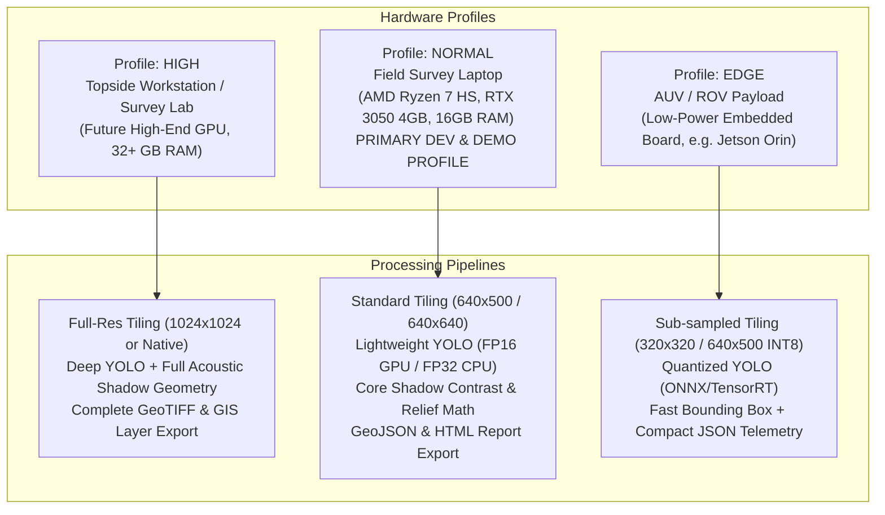
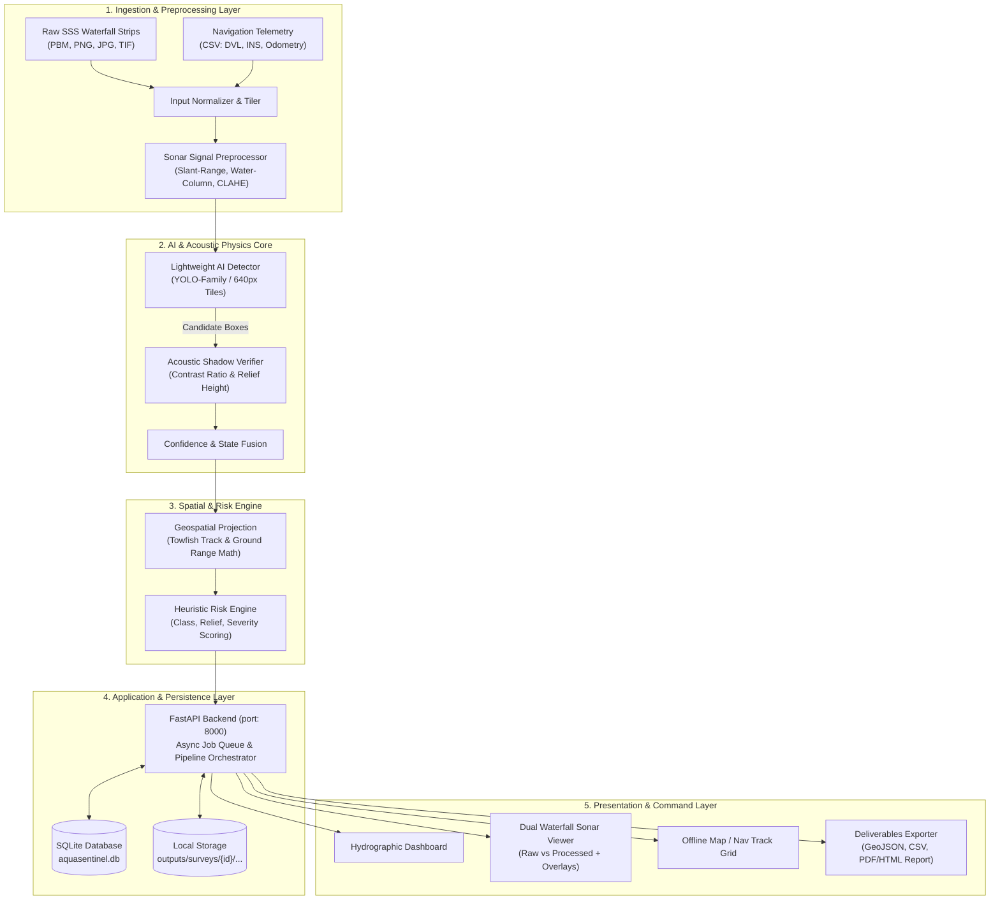
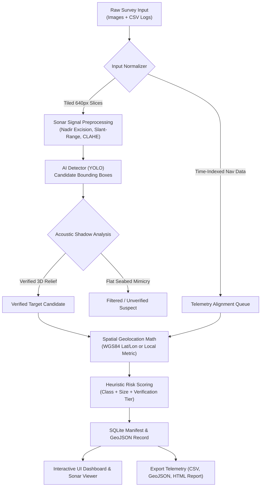
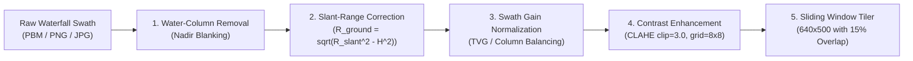
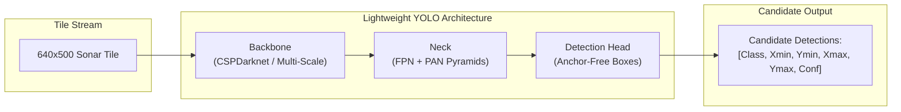
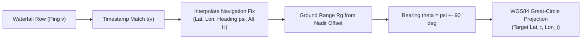
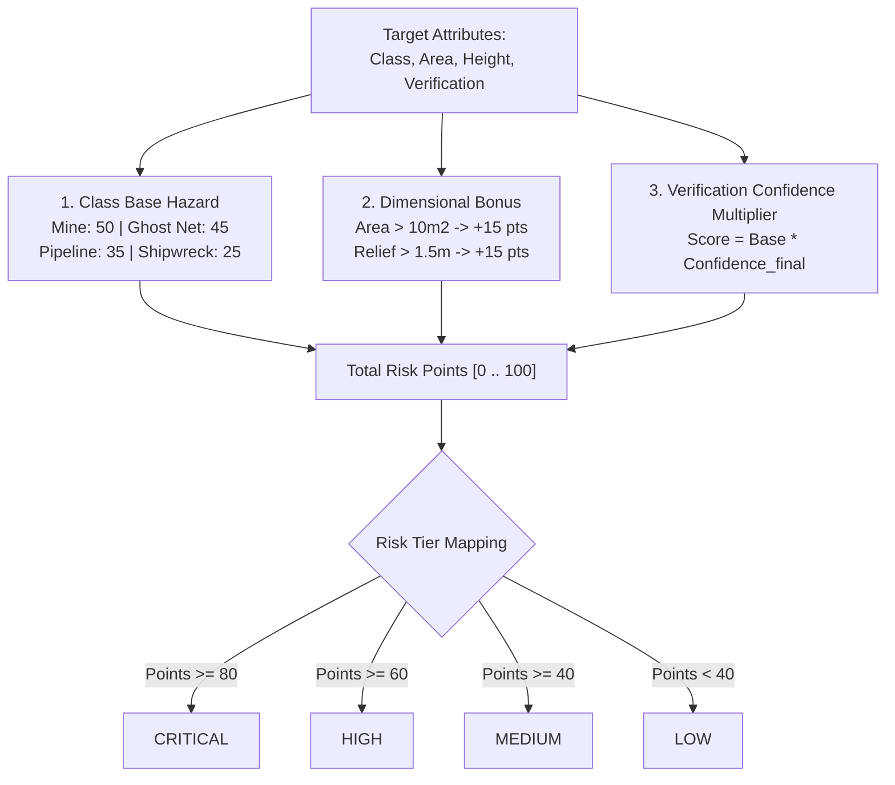
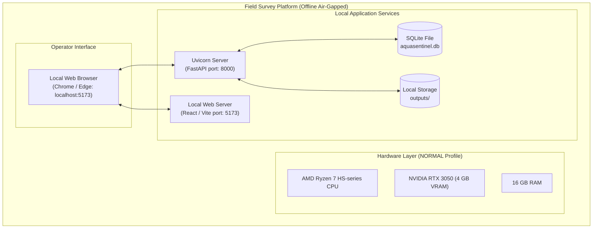
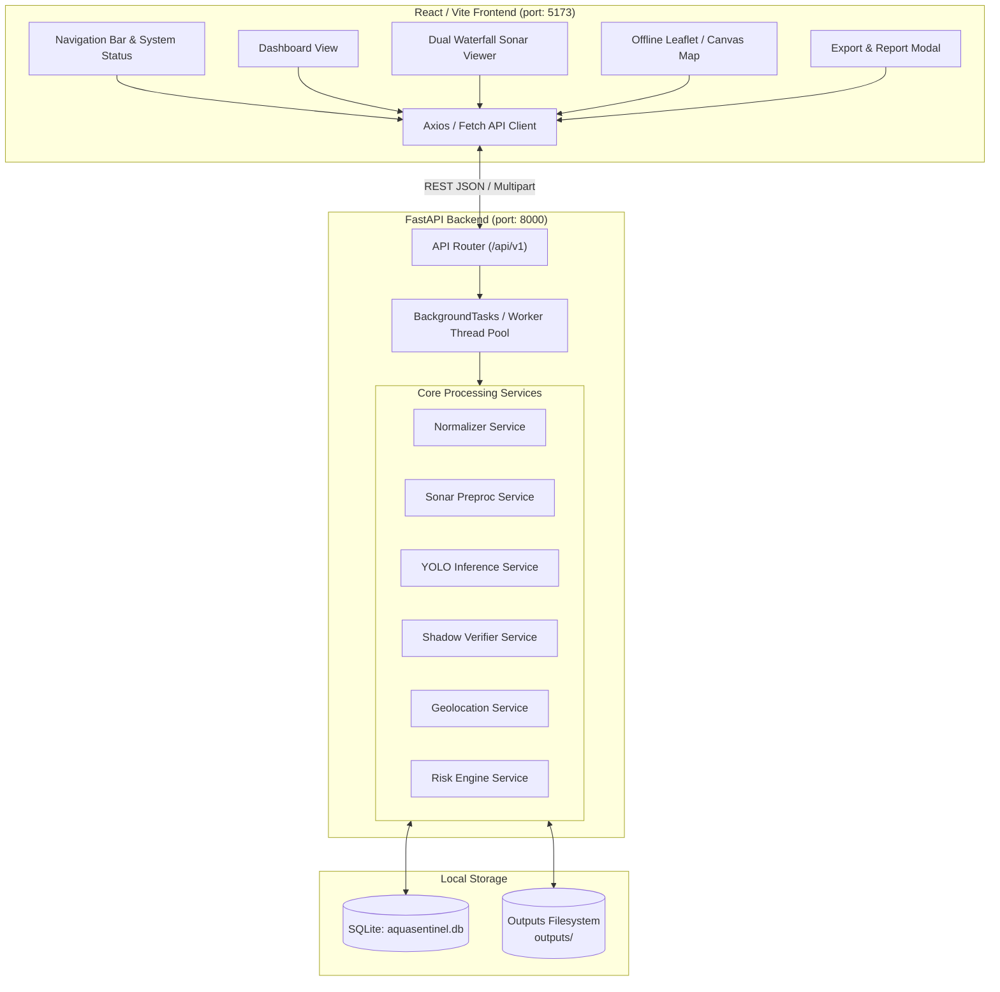

# AquaSentinel AI
## Master Project Specification & Architecture Blueprint

> **SIH 2026 Problem Statement ID:** SIH26057  
> **Problem Statement Title:** AI-Powered Automated Underwater Marine Debris and Anomaly Detection System using Side-Scan Sonar Imagery  
> **Theme:** Sustainable / Marine Environmental Monitoring  
> **Category:** Software  
> **Team Name:** Commit & Crack  
> **Document Status:** Master Architecture Specification & Single Source of Truth (SSOT)  
> **Specification Version:** 1.1.0-AUDITED-BASELINE  
> **Last Updated:** 2026-09-09  

---

## 1. Document Control & Audit Overview

### 1.1 Revision History
| Version | Date | Author / Role | Summary of Changes | Status |
| :--- | :--- | :--- | :--- | :--- |
| **0.1.0-DRAFT** | 2026-09-08 | Architecture Team | Initial extraction from SIH26057 presentation and README. | Superseded |
| **1.0.0-PROTOTYPE-SPEC** | 2026-09-09 | Multi-Disciplinary Team | Comprehensive architectural baseline and preliminary specs. | Superseded |
| **1.1.0-AUDITED-BASELINE** | 2026-09-09 | Lead Systems Architect | Comprehensive workspace audit, empirical dataset measurements (SubPipeMiniSSS, drishti-sss, AI4Shipwrecks), developer hardware constraints (Ryzen 7 HS, RTX 3050 4GB, 16GB RAM), SidescanTools evaluation, memory-aware AI strategy, and full Mermaid diagram suite. | Superseded |
| **1.2.0-YOLOSEG-ALIGNED** | 2026-09-09 | Multi-Disciplinary Team | Aligned with prototype prompt: Ultralytics YOLO-Seg instance segmentation, GhostVision (ghost gear) + SSS-Mine/NOMBO (AUV targets/background) training strategy, Google Colab GPU training workflow, non-rejecting acoustic shadow evidence rater, graceful metadata degradation ladder, clean repository layout, and incremental roadmap (V0.1 - V1.0). | **Active / Approved SSOT** |

### 1.2 Document Purpose
This master specification is the **SINGLE SOURCE OF TRUTH (SSOT)** for AquaSentinel AI. Every software engineer, ML researcher, hydrographic consultant, AI coding agent, and hackathon evaluator must treat this document as the definitive system baseline.

No code, AI model training script, backend route, or UI component shall be implemented that contradicts this specification without an approved revision to this document.

### 1.3 Implementation Status Legend
AquaSentinel strictly enforces empirical truthfulness. Features and sub-systems are marked with one of five operational tags:

- `[IMPLEMENTED]`: Code exists in the repository, is tested, and functions in the active build.
- `[EXPERIMENTAL]`: Code or research prototype exists in a branch; undergoing feasibility testing.
- `[PLANNED]`: Architecturally finalized and scheduled for implementation during current phase.
- `[PROPOSED]`: Conceptual design under architectural evaluation; not yet scheduled.
- `[NOT STARTED]`: Acknowledged requirement with no active code footprint in the repository.

> [!IMPORTANT]
> **Current Application Status**: As of 2026-09-09, **Application Implementation is NOT YET STARTED**. The workspace contains only project documentation, environment templates, and external datasets/tools. No backend, frontend, or model training code has been written yet.

---

## 2. Project Overview & SIH Problem Statement

### 2.1 Problem Statement Context (SIH26057)
- **Hackathon:** Smart India Hackathon 2026
- **Problem Statement ID:** SIH26057
- **Title:** AI-Powered Automated Underwater Marine Debris and Anomaly Detection System using Side-Scan Sonar Imagery
- **Theme:** Sustainable / Marine Environmental Monitoring
- **Category:** Software
- **Team Name:** Commit & Crack

### 2.2 The Subsea Operational Challenge
Side-Scan Sonar (SSS) is the primary acoustic instrument used to map the seafloor over large corridors. However, inspecting raw sonar records poses immense operational hurdles:
1. **Manual Inspection Bottleneck:** Human sonar hydrographers spend 6 to 12 hours manually scrolling through acoustic waterfalls for every 1 hour of subsea acoustic survey.
2. **Acoustic Noise & Artifacts:** Sonar imagery represents acoustic backscatter intensity, corrupted by speckle noise, water-column nadir blind zones, surface multi-path reflections, and platform motion (pitch/roll/yaw).
3. **Seafloor Debris Mimicry:** Natural seabed structures (boulders, coral outcrops, sand ridges) exhibit high backscatter mimicking artificial debris, triggering excessive false alarms in naive computer vision detectors.
4. **Offline Remote Environment:** Surveys take place offshore on survey vessels or autonomous underwater vehicles (AUVs) with zero cloud or internet connectivity.
5. **Decoupled Telemetry:** Sonar imagery is frequently disconnected from navigation logs (INS, DVL, towfish layback), making real-world target recovery difficult.

### 2.3 The AquaSentinel Solution
AquaSentinel AI is an offline-capable, hardware-aware, edge-adaptive processing and target recognition platform that:
- Ingests raw side-scan sonar waterfall records and synchronized vehicle navigation telemetry.
- Normalizes acoustic geometry via water-column excision, slant-range correction, and empirical gain balancing.
- Detects candidate debris using multi-scale deep learning models fine-tuned on real sonar imagery.
- Verifies physical targets using an explainable **Acoustic Shadow Verification** layer based on acoustic physics.
- Projects verified detections into real-world geographic coordinates (WGS84 Lat/Lon or local metric odometry).
- Prioritizes targets via a transparent, heuristic **Risk Engine**.
- Presents results on an interactive offline hydrographic dashboard and exports GIS-ready deliverables (GeoJSON, CSV, PDF/HTML reports).

---

## 3. Development Hardware Constraints & Hardware-Aware AI Design

### 3.1 Developer Primary Hardware Profile
The primary development and demonstration platform is the developer's laptop, rigorously profiled as:

| Subsystem | Specification | Operational Constraint |
| :--- | :--- | :--- |
| **CPU** | AMD Ryzen 7 HS-series CPU | Multi-threaded preprocessing, I/O slicing, CPU fallback inference |
| **GPU** | NVIDIA GeForce RTX 3050 Laptop GPU | **4 GB VRAM** (Strict memory budget for AI models & tiling) |
| **System RAM**| 16 GB RAM | In-memory survey caching, background worker thread pools |
| **Operating System** | Windows 11 (PowerShell / WSL2 compatible) | Cross-platform Python 3.12/3.13 and Node.js runtime |

*(Note: The CPU is documented strictly as AMD Ryzen 7 HS-series CPU without fabricating arbitrary sub-variants in general architecture.)*

### 3.2 Hardware-Aware AI Design Principles
The 4 GB VRAM and 16 GB RAM constraints dictate specific engineering requirements:
1. **Lightweight AI Model Selection:** Prefer lightweight single-stage detectors (e.g., YOLOv8n / YOLOv8s or YOLO11n / YOLO11s). Heavy models (YOLOv8x, massive vision transformers) exceed 4 GB VRAM during training or batched inference and are strictly prohibited for initial prototypes.
2. **Conservative Tile Dimensions:** Standardize on $640 \times 640$ (or $640 \times 500$) pixel tiles during initial experiments. Avoid native full-swath multi-thousand-pixel tensor passes in a single batch.
3. **Memory-Conscious Batching:**
   - Training: Batch size 8 to 16 with gradient accumulation if fine-tuning locally on the RTX 3050.
   - Inference: Batch size 1 to 4 tiles concurrently to preserve VRAM for UI and backend buffers.
4. **CUDA Inference with Robust CPU Fallback:**
   - GPU Mode: Active when CUDA is detected and VRAM is sufficient (`device = "cuda:0"`).
   - CPU Fallback: Seamless automatic fallback to AMD Ryzen 7 multi-core CPU (`device = "cpu"`) if CUDA is unavailable, VRAM is exhausted, or the system is running on a low-power battery profile.
5. **Generator-Based Streaming:** Never load entire 15,000-pixel multi-channel waterfalls into GPU memory simultaneously. Use generator-based sliding window nano-tiling with garbage collection.
6. **Prototype Over Maximum Model Size:** The primary objective is a reliable, responsive, end-to-end working pipeline, not state-of-the-art model parameter scale.

---

## 4. Hardware-Aware Adaptive Compute Architecture

The system supports three conceptual compute profiles matching operational deployment tiers:



| Parameter | Profile 1: HIGH (Topside) | Profile 2: NORMAL (Field Laptop) | Profile 3: EDGE (AUV / ROV) |
| :--- | :--- | :--- | :--- |
| **Operational Target** | Office Hydrographic Lab | Field Wheelhouse / Topside Desk | Autonomous Subsea Vehicle Payload |
| **Target Hardware** | Future High-End GPU (RTX 4080/A5000) | **AMD Ryzen 7 HS + RTX 3050 4GB + 16GB RAM** | Low-Power Embedded Board (Jetson Orin Nano) |
| **Model Precision** | FP32 / FP16 | FP16 GPU / FP32 CPU Fallback | INT8 / FP16 TensorRT or ONNX |
| **Tile Resolution** | $640 \times 640$ (Overlap: 25%) | $640 \times 500$ (Overlap: 15%) | $640 \times 500$ or $320 \times 320$ (No overlap) |
| **Verification Scope** | Full (Contour + Relief + TVG) | Explainable Contrast + Shadow Height | Fast (Thresholded contrast check) |
| **Throughput Target** | $\ge 40\text{ fps}$ (Batch GPU) | $\ge 15\text{ fps}$ (RTX 3050) / $\ge 6\text{ fps}$ (CPU) | $\ge 12\text{ fps}$ (Embedded NPU/GPU) |
| **Primary Output** | Full GIS, GeoTIFF, PDF Report | GeoJSON, CSV, Web Dashboard | Compact UDP/Serial JSON Telemetry |

> [!NOTE]
> The developer's RTX 3050 laptop represents the **NORMAL / DEVELOPMENT** profile. It is NOT an embedded AUV edge payload, but rather the real-world field survey laptop standard. The adaptive compute layer must dynamically configure tiling, model precision, and verification intensity based on this profile.

---

## 5. System Architecture



---

## 6. End-to-End Data Flow



---

## 7. Target Users & User Personas

### Persona 1: Vikram — Field Hydrographic Surveyor (Vessel Topside)
- **Environment**: Aboard an 18-meter coastal survey vessel with rough seas and zero internet connectivity.
- **Hardware**: Field laptop equipped with AMD Ryzen 7 HS processor and NVIDIA RTX 3050 GPU (4 GB VRAM).
- **Need**: Rapidly inspect 50 line-kilometers of dual-frequency SSS waterfall records collected during the morning run before the afternoon tide turns.
- **Pain Point**: Spending 8 hours manually scrolling through waterfalls; needs automated candidate flagging to prioritize the top 15 suspect anomalies for diver inspection.

### Persona 2: Dr. Elena — Marine Ecologist & NGO Lead (Coral Habitat Protection)
- **Environment**: Island conservation station with limited solar power and intermittent satellite link.
- **Hardware**: Standard 16 GB RAM laptop operating on battery power.
- **Need**: Locate abandoned, submerged nylon ghost nets entangled across sensitive coral reef corridors.
- **Pain Point**: Natural coral ridges trigger constant false alarms in standard vision software; needs physics-based acoustic shadow validation to confirm genuine three-dimensional netting hazards.

### Persona 3: Commander Nathan — Naval Clearance Diver & Salvage Officer
- **Environment**: Offshore patrol vessel wheelhouse coordinating clearance diving operations.
- **Hardware**: Ruggedized standalone workstation disconnected from external networks (air-gapped).
- **Need**: Immediate, clear geospatial coordinates (WGS84) and physical dimensions ($L \times W \times h$) for scuttled containers and submerged cylindrical hazards.
- **Pain Point**: Fragmented data formats; needs a single unified GeoJSON/CSV deliverable and printable PDF dive-briefing hazard sheet.

---

## 8. System Scope & Non-Goals

### 8.1 System Scope
AquaSentinel AI encompasses:
1. **Multi-Source Sonar Ingestion:** Ingesting raw acoustic strips (`.pbm`, `.png`, `.jpg`, `.tif`) and synchronized hydrographic telemetry (`.csv`).
2. **Deterministic Preprocessing:** Water-column excision, Pythagorean slant-range correction, and contrast normalization.
3. **Multi-Class Detection:** Localizing submarine pipelines, shipwrecks, ghost nets, and cylindrical debris.
4. **Physical Acoustic Verification:** Down-range shadow analysis, shadow contrast ratio, and acoustic relief height calculation.
5. **Spatial Projection:** Mapping image coordinates to WGS84 coordinates (or local odometry) using synchronized heading, altitude, and ground range.
6. **Risk Prioritization:** Heuristic hazard scoring (`LOW`, `MEDIUM`, `HIGH`, `CRITICAL`).
7. **Offline Operations Dashboard:** Dual-waterfall visualization, offline geospatial map, target inspection drawer, and deliverable exports.

### 8.2 Non-Goals
AquaSentinel AI explicitly excludes:
- **Cloud-Dependent AI Services:** Zero integration with OpenAI, AWS Rekognition, or cloud-hosted inference endpoints.
- **Real-Time Sonar Hardware Transceiver Control:** AquaSentinel does not control transducer beamformers or transmit pulses; it operates on digital backscatter records.
- **Multi-Beam Bathymetric Point-Cloud Draping:** The MVP focuses on 2D side-scan sonar waterfall processing, not full 3D multibeam point clouds.
- **Autonomous Vehicle Flight Guidance:** AquaSentinel outputs geotagged targets; it does not issue autopilot waypoint commands to AUV propulsion units.

---

## 9. Functional & Non-Functional Requirements

### 9.1 Functional Requirements (FR)
- `FR-ING-01`: The system shall ingest side-scan sonar waterfall images in PBM, PNG, JPEG, and TIFF formats.
- `FR-ING-02`: The system shall ingest synchronous vehicle navigation CSV files containing timestamps, altitude, heading, and spatial coordinates.
- `FR-ING-03`: The system shall validate image header dimensions and sanitize uploaded filenames against directory traversal.
- `FR-PRP-01`: The system shall identify nadir water-column boundaries and provide an option for nadir excision.
- `FR-PRP-02`: The system shall execute Pythagorean slant-range correction using vehicle altitude: $R_{\text{ground}} = \sqrt{R_{\text{slant}}^2 - H^2}$.
- `FR-PRP-03`: The system shall apply Contrast Limited Adaptive Histogram Equalization (CLAHE) to enhance acoustic shadow boundaries.
- `FR-DET-01`: The system shall detect candidate anomalies and emit bounding boxes $[x_{\min}, y_{\min}, x_{\max}, y_{\max}]$ with visual confidence scores.
- `FR-VRF-01`: The system shall extract the down-range region behind candidate targets and compute the acoustic shadow contrast ratio: $C_{\text{contrast}} = 1.0 - \frac{\mu_{\text{shadow}}}{\mu_{\text{seabed}}}$.
- `FR-VRF-02`: The system shall estimate target physical relief height: $h_{\text{relief}} = \frac{H \cdot L_{\text{shadow}}}{R_{\text{slant}}}$.
- `FR-GEO-01`: The system shall map target image coordinates to real-world WGS84 Latitude/Longitude using vessel navigation fixes.
- `FR-GEO-02`: If GPS is unavailable and local metric odometry is supplied, the system shall project targets in local cartesian meters (`LOCAL_METRIC_ODOMETRY`).
- `FR-RSK-01`: The system shall compute a heuristic hazard score $[0, 100]$ based on target class, dimensions, relief height, and verification status.
- `FR-OUT-01`: The system shall export target records in standard RFC 7946 GeoJSON.
- `FR-OUT-02`: The system shall export target catalogs in CSV format for spreadsheet analysis.
- `FR-OUT-03`: The system shall generate printable HTML/PDF mission hazard reports.

### 9.2 Non-Functional Requirements (NFR)
- `NFR-PERF-01`: In NORMAL compute profile, peak GPU VRAM consumption shall not exceed **3.2 GB**, maintaining a safe margin on 4 GB GPUs.
- `NFR-PERF-02`: The system shall automatically fall back to CPU inference if CUDA is unavailable or VRAM allocation fails.
- `NFR-OFFLINE-01`: The system shall execute 100% of core functions with zero internet or cloud network connectivity.
- `NFR-MODULAR-01`: Preprocessing, AI detection, acoustic verification, and geospatial projection modules shall be strictly decoupled.
- `NFR-CONFIG-01`: All dataset paths and runtime configurations shall be managed through `.env` environment variables.

---

## 10. Dataset Physical Audit & Findings

A comprehensive physical inspection of all external folders placed in the workspace was executed on 2026-09-09. The findings are documented below without speculation.

### 10.1 Dataset A: `AI4Shipwrecks`
- **Location in Workspace:** `d:\Projects\AquaSentinel\AI4Shipwrecks`
- **Total Physical Size:** **1,161.37 MB (1.13 GB)**
- **Total Files:** 573 files (572 PNG files + 1 `README.txt`)
- **Sensor & Platform:** Iver3 Autonomous Underwater Vehicle (AUV) equipped with an EdgeTech 2205 dual-frequency ultra-high-resolution sidescan sonar and 3D bathymetric system.
- **Survey Site:** NOAA Thunder Bay National Marine Sanctuary (Alpena, MI), Lake Huron.
- **Provenance & Authors:** Sethuraman, Sheppard, Bagoren, Pinnow, Anderson, Havens, Skinner (University of Michigan Field Robotics Group, Jan 2024). Award #NA21OAR0110196.
- **Image Characteristics:**
  - File Format: PNG (`.png`).
  - Image Width: Exactly $1,728\text{ pixels}$ across all swaths.
  - Image Length: Variable waterfall survey lengths ranging from $2,476\text{ pixels}$ up to $13,760+\text{ pixels}$.
  - Color Space: Grayscale / 8-bit single-channel acoustic backscatter.
- **Annotation & Labels:**
  - Format: Binary PNG semantic segmentation masks (`0` = non-shipwreck / background seabed, `1` = shipwreck).
  - Paired 1-to-1 with images: Each image in `images/` has an identically named mask in `labels/`.
- **Directory Splits:**
  - `train/images`: 141 PNG swaths | `train/labels`: 141 PNG masks (13 distinct named shipwreck sites).
  - `test/images`: 120 PNG swaths | `test/labels`: 120 PNG masks (14 distinct named shipwreck sites).
  - `extras/terrain/images`: 25 PNG swaths | `extras/terrain/labels`: 25 PNG masks (0 shipwrecks; natural reefs/boulders).
- **Navigation & Telemetry:** **None present** in this distribution. Telemetry was stripped during the benchmark publication; only pixel-space images and masks are provided.
- **Licensing:** Creative Commons Attribution 4.0 International (CC-BY-4.0).
- **Primary Utility in AquaSentinel:** Ideal validation benchmark for large-structure detection, tiling engine stress-testing, and using the 25 `extras/terrain` swaths for **false-positive rejection benchmarking**.

---

### 10.2 Dataset B: `drishti-sss`
- **Location in Workspace:** `d:\Projects\AquaSentinel\drishti-sss`
- **Total Physical Size:** **3,882.59 MB (3.79 GB)** on disk; **1,940.19 MB (1.89 GB)** excluding `.git` history.
- **Total Files:** **5,205 images + 5,205 YOLO labels** + `drishti.yaml` + `README.md`.
- **Provenance & Authors:** Rehan Fazal et al. ([GitHub: Rehan9599/Sonar-Drishti](https://github.com/Rehan9599/Sonar-Drishti)), created for SIH 2026 Problem Statement 26057.
- **Image Characteristics:**
  - Format: JPEG (`.jpg`).
  - Resolution: Standardized **$640 \times 500\text{ pixels}$** across all splits.
  - Preprocessing Already Applied: **7x7 Lee speckle filter + CLAHE** (clip limit 3.0, 8x8 grid). Tiles are pre-enhanced; no secondary despeckling should be applied during training.
- **Annotation & Labels:**
  - Format: YOLO normalized text (`class_id x_center y_center width height`).
  - Class Definition (`drishti.yaml`):
    - `0: crab_pot`
    - `1: submarine_pipeline`
    - `2: shipwreck`
    - `3: ghost_net`
    - `4: mine_cylinder`
- **Physical Count Audit across Splits:**
  | Split | Images | Labels | Empty Labels (Hard Negatives) | Pipeline (1) | Shipwreck (2) | Ghost Net (3) | Mine Cylinder (4) | Crab Pot (0) |
  | :--- | :--- | :--- | :--- | :--- | :--- | :--- | :--- | :--- |
  | **train** | 3,875 | 3,875 | 500 | 1,000 | 1,554 | 900 | 843 | **0** |
  | **val** | 630 | 630 | 70 | 147 | 544 | 120 | 93 | **0** |
  | **test** | 700 | 700 | 70 | 174 | 525 | 120 | 82 | **0** |
  | **TOTAL** | **5,205** | **5,205** | **640** | **1,321** | **2,623** | **1,140** | **1,018** | **0** |
- **Critical Audit Findings:**
  1. **Class 0 (`crab_pot`) has ZERO instances.** The HuggingFace source dataset was access-gated; therefore, class 0 was omitted in this release.
  2. **Class 3 (`ghost_net`) is 100% synthetic.** Created via procedural acoustic generation due to the global scarcity of open public ghost net sonar swaths.
  3. **640 Hard-Negative Background Tiles.** Essential for training detectors to avoid false alarms on barren seafloors.
- **Navigation & Telemetry:** **None present** (bounding box annotations only).
- **Licensing:** Creative Commons Attribution-ShareAlike 4.0 International (CC-BY-SA-4.0).
- **Primary Utility in AquaSentinel:** Immediate, turn-key dataset for training and validating the initial lightweight YOLO object detector.

---

### 10.3 Dataset C: `SubPipeMiniSSS`
- **Location in Workspace:** `d:\Projects\AquaSentinel\SubPipeMiniSSS`
- **Total Physical Size:** **14,876.23 MB (14.53 GB)**
- **Sensor:** Klein3500 dual-frequency side-scan sonar (Low Frequency: 455 kHz, High Frequency: 900 kHz).
- **Provenance & Authors:** Álvarez-Tuñón et al., OceanScan-MST / Zenodo benchmark for subsea pipeline inspection.
- **Folder Breakdown:**
  - `DATA/SSS_HF_images/`: 7,231.50 MB | **1,011 `.pbm` images** (5000 $\times$ 500 px, 900 kHz) | 671 YOLO txt files | 1 `coco_format.json`
  - `DATA/SSS_LF_images/`: 3,773.28 MB | **1,055 `.pbm` images** (5000 $\times$ 500 px, 455 kHz) | 697 YOLO txt files | 1 `coco_format.json`
  - `DATA/Cam0_images/`: 3,808.11 MB | 16,200 visual camera images (GoPro $2704 \times 1520$, 30 Hz)
  - `DATA/Cam1_images/`: 42.19 MB | 430 grayscale camera images ($1936 \times 1216$, 4 Hz)
  - `config.yaml`: Sensor physical parameters (TVG factor: 280, colormap: bronze, horizontal angle: 20°).
- **Navigation & Telemetry CSV Logs (10 Synchronized Files, 16,202 rows each):**
  - `EstimatedState.csv` (5.88 MB): Timestamp, local odometry position $[x, y, z]$, attitude $[\phi, \theta, \psi]$ (roll, pitch, yaw in rad), velocities $[u, v, w, v_x, v_y, v_z]$, angular rates $[p, q, r]$, depth ($m$), and altitude ($m$).
  - `Altitude.csv` (2.43 MB): Synchronous 4-beam Doppler Velocity Log (DVL) altitude.
  - `Acceleration.csv` (1.96 MB), `AngularVelocity.csv` (2.07 MB), `Depth.csv` (1.36 MB), `ForwardDistance.csv` (1.40 MB), `Pressure.csv` (1.28 MB), `Rpm.csv` (1.35 MB), `Temperature.csv` (1.38 MB), `WaterVelocity.csv` (2.03 MB).
- **Annotation & Labels:** Single class `Pipeline` (YOLO class id `0`; COCO category id `1`).
- **Licensing:** Creative Commons Attribution 4.0 International (CC-BY-4.0).
- **Primary Utility in AquaSentinel:** The **single most important dataset for full end-to-end integration testing**, linking raw multi-thousand-pixel sonar waterfall strips directly to time-synchronized 6-DOF vehicle navigation and altitude telemetry.

---

## 11. Dataset Matrix & Evidence-Based AI Strategy

### 11.1 Empirical Dataset Matrix
| Dataset Name | Role / Purpose | Modality | Annotations | Active Classes | Nav Logs | Coordinates | Primary Environment |
| :--- | :--- | :--- | :--- | :--- | :--- | :--- | :--- |
| **GhostVision** | **Primary Prototype Training** | SSS Tiles / Swaths | Polygon / Seg | Crab pots, ghost gear | No | None | **Google Colab GPU** |
| **SSS-Mine / NOMBO** | **Target & Hard Background FP** | Real AUV SSS | Polygons / Boxes | Mine-like targets, clutter | Yes (Mission) | Lat/Lon | **Google Colab GPU** |
| **SubPipeMiniSSS** | **E2E Pipeline / Telemetry** | Dual Freq SSS (Klein3500) | COCO & YOLO | Pipeline | **Yes (10 CSVs)** | Local $(x, y, z)$ | Local Workstation |
| **AI4Shipwrecks** | **Hard Negative FP Benchmark** | Dual Freq AUV (EdgeTech) | Binary PNG Masks | Shipwreck, 25 Terrain BG | No | None | Local Workstation |
| **drishti-sss** | **Pre-tiled baseline archive** | Multi-source SSS | YOLO Boxes | 4 classes (synthetic net) | No | None | Local Benchmark |

> [!IMPORTANT]
> **Dataset Anti-Hallucination Rules**:
> 1. **SSS-Mine / NOMBO is an AUV mine/target dataset**, used for difficult targets, acoustic shadows, and false-positive background suppression. Do **NOT** claim SSS-Mine is a ghost net dataset.
> 2. **GhostVision is the primary dataset** for ghost fishing gear and crab-pot-type objects.
> 3. Avoid random image splitting. **Split by survey/mission/source** so test data represents unseen scenes and prevents data leakage.

### 11.2 Training & Prototype Workflow (Google Colab GPU)
Model training is decoupled from local developer hardware limits:
```text
GhostVision + SSS-Mine
        ↓
ml/prepare_dataset.py (Polygon normalization & survey-based splitting)
        ↓
Unified YOLO-Seg Dataset (dataset.yaml)
        ↓
Google Colab GPU Training (ml/train.py, yolo11n-seg.pt)
        ↓
Validation & Unseen Mission Test Set Evaluation (ml/evaluate.py)
        ↓
Export best.pt to local `models/best.pt`
        ↓
Local Offline Application (FastAPI + React Dashboard)
```

---

## 12. Dataset Storage, Repository Hygiene & Git Boundaries

### 12.1 Storage Reality & Git Enforcement
The external datasets total **$\approx 19.5\text{ GB}$** on disk. Committing multi-gigabyte binary datasets to Git permanently corrupts repository history, breaks clones, and violates repository hygiene.

> [!CAUTION]
> **MANDATORY GIT RULES**:
> 1. NEVER execute `git add` on `SubPipeMiniSSS/`, `AI4Shipwrecks/`, `drishti-sss/`, or `sidescantools/`.
> 2. All four folders MUST be permanently excluded in `.gitignore`.
> 3. Large model checkpoints (`*.pt`, `*.onnx`, `*.engine`) must never be committed.

### 12.2 Preferred Eventual File Organization
While the folders currently reside inside the root directory for development convenience, the recommended long-term organization decouples the application code from heavy assets:

```text
aquasentinel/
├── backend/
│   ├── main.py                     # FastAPI application & REST endpoints
│   ├── input_normalizer.py         # Multi-source ingestion & graceful degradation
│   ├── database.py                 # SQLite models and session management
│   ├── pipeline/
│   │   ├── preprocess.py           # Water-column blanking, CLAHE, TVG
│   │   ├── slant_range.py          # Pythagorean ground-range correction
│   │   ├── tiling.py               # 640x640 overlapping sliding-window tiler
│   │   ├── inference.py            # Adaptive YOLO-Seg inference (GPU/CPU fallback)
│   │   ├── shadow_gate.py          # Non-rejecting acoustic shadow evidence rater
│   │   ├── geolocation.py          # WGS84 great-circle & local odometry math
│   │   └── quality.py              # Sonar SNR & image quality metrics
│   └── reports.py                  # GeoJSON, CSV, and summary report generator
│
├── ml/
│   ├── prepare_dataset.py          # GhostVision + SSS-Mine conversion to YOLO-Seg
│   ├── train.py                    # Ultralytics YOLO-Seg Colab training script
│   └── evaluate.py                 # Benchmarking (Precision, Recall, mAP50-95)
│
├── frontend/                       # React + Vite + TypeScript + Tailwind UI
├── data/                           # Local sample strips & test datasets
└── models/                         # Local exported weights (best.pt)
```

### 12.3 Environment Variable Paths (`.env`)
```bash
# Primary ML Datasets
GHOSTVISION_DATA_PATH=./data/GhostVision
SSSMINE_DATA_PATH=./data/SSS-Mine

# Local Benchmark / Telemetry Datasets
DRISHTI_DATA_PATH=d:/Projects/AquaSentinel/drishti-sss
SUBPIPE_DATA_PATH=d:/Projects/AquaSentinel/SubPipeMiniSSS
AI4SHIPWRECKS_DATA_PATH=d:/Projects/AquaSentinel/AI4Shipwrecks
SIDESCANTOOLS_PATH=d:/Projects/AquaSentinel/sidescantools

# Application Storage & Models
OUTPUT_STORAGE_PATH=./outputs
MODEL_WEIGHTS_PATH=./models/best.pt
SQLITE_DB_PATH=./outputs/aquasentinel.db
```

---

## 13. Target Class Taxonomy & Mapping

AquaSentinel establishes a conservative canonical taxonomy mapped to dataset-specific labels:

| AquaSentinel Canonical Class | drishti-sss Label | SubPipeMiniSSS Label | AI4Shipwrecks Label | Prototype Status | Risk Tier |
| :--- | :--- | :--- | :--- | :--- | :--- |
| `submarine_pipeline` | Class 1 (`submarine_pipeline`) | Class 0 / `'Pipeline'` | N/A | **Active (MVP)** | **HIGH** |
| `shipwreck` | Class 2 (`shipwreck`) | N/A | Mask pixel value `1` | **Active (MVP)** | **MEDIUM** |
| `ghost_net` | Class 3 (`ghost_net`) | N/A | N/A | **Active (Synthetic)** | **CRITICAL** |
| `mine_cylinder` | Class 4 (`mine_cylinder`) | N/A | N/A | **Active (MVP)** | **CRITICAL** |
| `other_debris` | [FUTURE] | N/A | N/A | Proposed (Post-MVP) | **LOW / MEDIUM** |
| `natural_seabed` | Empty labels (`bg_*.jpg`) | Unannotated seabed | `extras/terrain` | **Negative Filter** | **NONE** |

> [!WARNING]
> **Anti-Hallucination Notice Regarding `crab_pot`**: Class `0` (`crab_pot`) defined in `drishti.yaml` has **0 physical training instances** in the release. The prototype shall NOT claim crab pot detection capability until real labeled data is secured.

---

## 14. External SidescanTools Evaluation

### 14.1 Repository Profile
- **Repository Path:** `d:\Projects\AquaSentinel\sidescantools`
- **Origin:** Joint open-source project by GEOMAR Helmholtz Centre for Ocean Research Kiel and sonoware GmbH, funded by the AI Fund of the State of Schleswig-Holstein.
- **License:** **GNU General Public License v3.0 (GPL-3.0)**.
- **Target Formats:** `.xtf` (eXtended Triton Format) and `.jsf` (EdgeTech open format).

### 14.2 Core Capabilities
1. **Bottom-Line Detection (BLD):** Automatic edge detection or interactive UI (via `napari`) to identify seafloor first returns across port and starboard channels.
2. **Slant-Range Correction:** Projects acoustic slant ranges onto a flat seafloor plane using sensor altitude.
3. **Radiometric Gain Normalization:**
   - Beam Angle Correction (BAC): Single-file intensity averaging per beam angle.
   - Empirical Gain Normalization (EGN): Multi-file beam and range table normalization.
4. **Noise Filtering:** 2D-FFT filter for stripe noise attenuation; homomorphic sharpening filter.
5. **Georeferencing & Export:** Converts processed acoustic pings into georeferenced GeoTIFFs using `pygmt` (`nearneighbor` and `blockmedian` gridding) or simple PNG waterfalls.
6. **CLI Batch Processing:** Headless execution via `main_cli.py <path> project_info.yml`.

### 14.3 Dependencies & Platform Compatibility
- Requires **Python 3.12+**.
- Relies heavily on **Conda-forge packages**: `gdal==3.10.3`, `pygmt==0.17.0`, `pyxtf==1.4.2`, `rioxarray`, `rasterio`, `utm`, `napari` (for GUI).
- `pygmt` and `gdal` require external compiled C/C++ libraries (GMT and GDAL binaries) that are difficult to install via standard `pip` on Windows without Anaconda/Miniconda.

### 14.4 Integration Limitations & Legal Implications
1. **GPL-3.0 Copyleft:** Incorporating `sidescantools` source code directly into AquaSentinel would force AquaSentinel under GPL-3.0. To protect project IP and maintain permissive architecture, its source code **MUST NOT be copied into AquaSentinel**.
2. **Heavy Runtime Overhead:** Mandating `sidescantools` as a permanent dependency would break the lightweight Python virtual environment setup on Windows.
3. **Scope Gap:** SidescanTools does not perform object detection, acoustic shadow classification, or risk scoring; it is strictly a hydrographic preprocessing utility.

### 14.5 Architectural Decision Status
- **Current Decision:** **"External / reference tool — integration not yet finalized."**
- **Permitted Use Cases:**
  1. *Algorithmic Reference:* Serve as an architectural blueprint for slant-range math and EGN principles implemented natively in lightweight OpenCV/NumPy.
  2. *Optional Subprocess CLI:* If a user provides raw `.xtf` or `.jsf` survey recordings, AquaSentinel can optionally trigger `sidescantools` as an external CLI sub-process to generate standardized PNG/GeoTIFF files prior to ingestion.

---

## 15. Sonar Signal Preprocessing Pipeline

AquaSentinel implements lightweight, native Python (OpenCV + NumPy) preprocessing:



### 15.1 Slant-Range Correction Math
Acoustic slant range $R_{\text{slant}}$ measures time-of-flight to the seabed. True horizontal ground distance $R_{\text{ground}}$ from nadir is derived via Pythagorean projection assuming local flat bathymetry:
$$R_{\text{ground}} = \sqrt{R_{\text{slant}}^2 - H^2}$$
Where $H$ is the towfish altitude above the seafloor (extracted from `Altitude.csv` or nadir bottom tracking).

### 15.2 Empirical Gain Normalization & CLAHE
To correct signal attenuation over acoustic grazing angles:
$$I_{\text{norm}}(u, v) = \frac{I_{\text{raw}}(u, v)}{\mu_{\text{column}}(u)} \times \bar{\mu}_{\text{swath}}$$
CLAHE is subsequently applied with a clip limit of $3.0$ over an $8 \times 8$ grid to boost contrast between acoustic highlights and shadows.

---

## 16. AI Vision Pipeline



### 16.1 Inference Workflow
1. Normalized $640 \times 500$ acoustic tiles pass to the lightweight YOLO model.
2. Output bounding boxes $[x_{\min}, y_{\min}, x_{\max}, y_{\max}]$ are filtered by detection threshold $\tau_{\text{AI}} \ge 0.35$.
3. Candidate boxes are mapped back to global waterfall coordinates.
4. Non-Maximum Suppression (NMS, $\text{IoU} \ge 0.45$) resolves cross-tile overlap duplicates.

---

## 17. Acoustic Verification Engine

Acoustic verification inspects the expected acoustic shadow region down-range from candidate targets along the acoustic beam propagation direction. Target geometry and seabed conditions affect shadow visibility; therefore, **detections are never automatically discarded solely due to absent shadows**.

```mermaid
flowchart TD
    DET["Candidate Detection (YOLO-Seg)<br/>Polygon Mask & Box"] --> GEOM["Determine Cross-Track Direction<br/>(Port vs Starboard relative to Nadir)"]
    GEOM --> CROP["Extract Expected Shadow Region Crop<br/>(Extend Down-Range away from Track)"]
    CROP --> CONTRAST["1. Shadow Contrast Analysis<br/>C = 1.0 - (I_shadow / I_seabed)"]
    CROP --> LENGTH["2. Shadow Length Measurement<br/>(Detect low-intensity boundary)"]
    CROP --> RELIEF["3. Acoustic Relief Height Math<br/>h = (H * L_shadow) / R_slant"]
    CONTRAST & LENGTH & RELIEF --> EVAL{"Shadow Evidence State"}
    EVAL -->|Shadow Present & Distinct| PASS["Evidence: SUPPORTING<br/>Boost Confidence, h calculated<br/>Status: VERIFIED"]
    EVAL -->|Shadow Indeterminate / Clutter| UNCLEAR["Evidence: NEUTRAL<br/>Confidence Unchanged<br/>Status: UNVERIFIED"]
    EVAL -->|Expected Shadow Absent| ABSENT["Evidence: ABSENT<br/>Soft Confidence Penalty<br/>Status: FLAGGED_FOR_REVIEW"]
```



### 17.1 Physical Relief Height Formula
If sensor altitude is $H$, target slant range is $R_{\text{slant}}$, and shadow length is $L_{\text{shadow}}$:
$$h_{\text{relief}} = \frac{H \cdot L_{\text{shadow}}}{R_{\text{slant}}}$$

### 17.2 Evidence Rating & State Transition Logic
- **`SUPPORTING` (Verified 3D Object):** Shadow contrast ratio $C_{\text{contrast}} \ge 0.40$ and measurable relief height $h_{\text{relief}} \ge 0.15\text{ m}$. Final confidence is boosted:
  $$\text{Confidence}_{\text{final}} = \min(1.0, \text{Confidence}_{\text{AI}} + 0.15 \times C_{\text{contrast}})$$
  Review status set to `VERIFIED`.
- **`NEUTRAL` (Ambiguous Context):** Low contrast or rugged seabed makes shadow boundary indeterminate. Confidence is retained:
  $$\text{Confidence}_{\text{final}} = \text{Confidence}_{\text{AI}}$$
  Review status set to `UNVERIFIED`.
- **`ABSENT` (Suspicious Flat Artifact):** High-confidence AI highlight with clear flat seabed where shadow should physically occur, but none is found. Soft penalty applied:
  $$\text{Confidence}_{\text{final}} = \max(0.20, \text{Confidence}_{\text{AI}} \times 0.85)$$
  Review status set to `FLAGGED_FOR_REVIEW`. Never automatically deleted or discarded.

---

## 19. Geospatial Projection & Navigation Interpolation



### 19.1 Coordinate Calculations
1. **Timestamp Matching:** Match sonar ping row timestamp $t_{\text{target}}$ to navigation log.
2. **Platform Position Interpolation:** Linearly interpolate platform position $(\text{Lat}_0, \text{Lon}_0)$, heading $\psi$, and altitude $H$.
3. **Cross-Track Ground Range ($R_{\text{ground}}$):**
   $$R_{\text{ground}} = |u_{\text{target}} - u_{\text{nadir}}| \times \Delta_{\text{meters\_per\_pixel}}$$
4. **Target Geographic Coordinates (WGS84):**
   $$\text{Lat}_{\text{target}} = \text{Lat}_0 + \frac{R_{\text{ground}} \cos(\psi \pm 90^\circ)}{R_{\text{Earth}}}$$
   $$\text{Lon}_{\text{target}} = \text{Lon}_0 + \frac{R_{\text{ground}} \sin(\psi \pm 90^\circ)}{R_{\text{Earth}} \cos(\text{Lat}_0)}$$
5. **Local Metric Fallback (`SubPipeMiniSSS`):** When GPS is unavailable and odometry $(x, y, z)$ is provided, coordinates are reported in the local vehicle frame (`LOCAL_METRIC_ODOMETRY`).

---

## 20. Dimension & Relief Estimation Math

- **Along-Track Length:** $\text{Length}_{\text{m}} = (y_{\max} - y_{\min}) \times V_{\text{vessel}} \times \Delta t_{\text{ping}}$
- **Cross-Track Width:** $\text{Width}_{\text{m}} = (x_{\max} - x_{\min}) \times \Delta_{\text{ground\_range\_per\_pixel}}$
- **Relief Height:** $h = \frac{H \cdot L_{\text{shadow}}}{R_{\text{slant}}}$

---

## 21. Operational Risk Engine



---

## 22. Offline-First Architecture & Local Runtime

Marine surveys operate in disconnected offshore waters. AquaSentinel requires **zero cloud connectivity**:
- **Local AI Inference:** Execution occurs locally via PyTorch / ONNX Runtime.
- **Local Web Server:** Local FastAPI backend (`localhost:8000`).
- **Local Database:** Embedded SQLite (`aquasentinel.db`).
- **Offline Hydrographic Map:** Leaflet.js with cached tile support or an automatic fallback to an **Offline Hydrographic Coordinate Canvas** plotting vehicle tracks and targets on a dynamic metric grid.
- **Zero External API Calls:** No remote telemetry, analytics, or external cloud vision dependencies.

---

## 23. Deployment Architecture



---

## 24. Unified Backend & Frontend Architecture



---

## 25. Backend Specification & REST API Contracts

### 25.1 Survey Management & Ingestion
- **`POST /api/v1/surveys/upload`**
  - *Request*: `multipart/form-data` with `sonar_file`, optional `nav_file`, `survey_name`.
  - *Response* (`201 Created`):
    ```json
    {
      "survey_id": "srv_20260909_001",
      "name": "Line_01_Klein3500_HF",
      "status": "UPLOADED",
      "image_dimensions": [5000, 500],
      "has_navigation": true,
      "created_at": "2026-09-09T03:00:00Z"
    }
    ```
- **`GET /api/v1/surveys`**: List all ingested surveys and processing statuses.
- **`GET /api/v1/surveys/{id}`**: Detailed survey manifest and telemetry summary.

### 25.2 Processing Jobs
- **`POST /api/v1/surveys/{id}/process`**
  - *Request*:
    ```json
    {
      "compute_profile": "NORMAL",
      "confidence_threshold": 0.35,
      "verification_threshold": 0.50,
      "apply_slant_range": true
    }
    ```
  - *Response* (`202 Accepted`):
    ```json
    {
      "job_id": "job_9843",
      "survey_id": "srv_20260909_001",
      "status": "PROCESSING",
      "estimated_tiles": 12
    }
    ```
- **`GET /api/v1/jobs/{job_id}`**: Poll real-time progress percentage and processing stage.

### 25.3 Target Detections
- **`GET /api/v1/surveys/{id}/detections`**: Array of all detected targets with bounding boxes, verification states, and risk tiers.
- **`GET /api/v1/detections/{target_id}/crop`**: Serve cropped image patch showing target highlight and acoustic shadow.

### 25.4 Deliverable Exports
- **`GET /api/v1/surveys/{id}/export/geojson`**: Export standard RFC 7946 GeoJSON target feature collection.
- **`GET /api/v1/surveys/{id}/export/csv`**: Export hydrographic target catalog in CSV format.
- **`GET /api/v1/surveys/{id}/report`**: Generate printable HTML/PDF mission hazard report.

### 25.5 System Health & Hardware Telemetry
- **`GET /api/v1/system/status`**: Report active compute profile, GPU name, available VRAM, CPU load, and offline status.

---

## 26. Frontend Architecture & UI/UX Specification

The frontend is an operational hydrographic dashboard styled with modern dark-mode oceanographic aesthetics:
1. **Operations Dashboard:** Summary KPI tiles (Total Surveys, Targets Detected, High/Critical Hazards, Hardware Status, Compute Profile).
2. **Sonar Waterfall Viewer:**
   - Dual-mode view: Side-by-side display of Raw acoustic backscatter vs Preprocessed/Corrected waterfall.
   - Interactive zoom ($0.25\times$ to $8\times$) and smooth panning across multi-thousand-pixel swaths.
   - Layer toggles: Toggle Bounding Boxes, Acoustic Shadow Overlays, Nadir Blanking Line, and Target IDs.
3. **Geospatial Map View:**
   - Renders vessel survey track lines and color-coded target risk markers (Green: Low, Yellow: Medium, Orange: High, Red: Critical).
   - Interactive marker selection syncing with target details.
   - Offline fallback to local canvas grid.
4. **Target Detail Drawer:** Deep inspection panel displaying target thumbnail, derived dimensions ($L \times W \times h$), acoustic contrast ratio, confidence score, and geolocation.
5. **System Telemetry Bar:** Persistent footer showing offline status (`OFFLINE / AIR-GAPPED`), active GPU (`RTX 3050`), and VRAM utilization.

---

## 27. Data Models & Local SQLite Storage Schema

```sql
CREATE TABLE surveys (
    id TEXT PRIMARY KEY,
    name TEXT NOT NULL,
    sonar_path TEXT NOT NULL,
    nav_path TEXT,
    format TEXT NOT NULL,
    width_px INTEGER NOT NULL,
    height_px INTEGER NOT NULL,
    sensor_frequency_khz REAL,
    status TEXT NOT NULL,
    created_at TIMESTAMP DEFAULT CURRENT_TIMESTAMP
);

CREATE TABLE detections (
    id TEXT PRIMARY KEY,
    survey_id TEXT NOT NULL REFERENCES surveys(id),
    class_name TEXT NOT NULL,
    confidence_ai REAL NOT NULL,
    verification_score REAL NOT NULL,
    confidence_final REAL NOT NULL,
    verification_status TEXT NOT NULL,
    x_min INTEGER NOT NULL,
    y_min INTEGER NOT NULL,
    x_max INTEGER NOT NULL,
    y_max INTEGER NOT NULL,
    relief_height_m REAL,
    length_m REAL,
    width_m REAL,
    latitude REAL,
    longitude REAL,
    local_x_m REAL,
    local_y_m REAL,
    risk_points REAL NOT NULL,
    risk_level TEXT NOT NULL,
    crop_path TEXT,
    created_at TIMESTAMP DEFAULT CURRENT_TIMESTAMP
);
```

### 27.1 Canonical Target JSON Schema
```json
{
  "$schema": "http://json-schema.org/draft-07/schema#",
  "title": "AquaSentinelTarget",
  "type": "object",
  "required": [
    "target_id", "survey_id", "class", "confidence", "verification",
    "bounding_box", "risk", "created_at"
  ],
  "properties": {
    "target_id": { "type": "string" },
    "survey_id": { "type": "string" },
    "class": { 
      "type": "string",
      "enum": ["submarine_pipeline", "shipwreck", "ghost_net", "mine_cylinder", "other_debris"]
    },
    "confidence": {
      "type": "object",
      "properties": {
        "ai_visual": { "type": "number", "minimum": 0.0, "maximum": 1.0 },
        "acoustic_verification": { "type": "number", "minimum": 0.0, "maximum": 1.0 },
        "composite": { "type": "number", "minimum": 0.0, "maximum": 1.0 }
      },
      "required": ["ai_visual", "acoustic_verification", "composite"]
    },
    "verification": {
      "type": "object",
      "properties": {
        "status": { "type": "string", "enum": ["VERIFIED", "UNVERIFIED_SUSPECT", "DISCARDED"] },
        "shadow_contrast": { "type": "number" },
        "relief_height_m": { "type": ["number", "null"] }
      },
      "required": ["status"]
    },
    "location": {
      "type": "object",
      "properties": {
        "coordinate_frame": { "type": "string", "enum": ["WGS84", "LOCAL_METRIC_ODOMETRY", "UNTAGGED"] },
        "latitude": { "type": ["number", "null"] },
        "longitude": { "type": ["number", "null"] },
        "local_x_m": { "type": ["number", "null"] },
        "local_y_m": { "type": ["number", "null"] }
      }
    },
    "dimensions": {
      "type": "object",
      "properties": {
        "length_m": { "type": ["number", "null"] },
        "width_m": { "type": ["number", "null"] },
        "area_m2": { "type": ["number", "null"] }
      }
    },
    "risk": {
      "type": "object",
      "properties": {
        "points": { "type": "number", "minimum": 0, "maximum": 100 },
        "level": { "type": "string", "enum": ["LOW", "MEDIUM", "HIGH", "CRITICAL"] }
      },
      "required": ["points", "level"]
    }
  }
}
```

---

## 28. Technology Stack Justification & Alternatives Matrix

| Layer | Selected Tech | Purpose | Technical Rationale | Evaluated Alternative | Decision Status |
| :--- | :--- | :--- | :--- | :--- | :--- |
| **Backend API** | FastAPI (Python 3.12/3.13) | REST API & Job Orchestration | Async native, tight PyTorch/OpenCV binding, Pydantic validation | Flask, Django | **Selected (MVP)** |
| **AI Inference**| Ultralytics YOLO (PyTorch) | Object Localization | Fast single-stage inference, fits 4GB VRAM, standard YOLO txt support | Faster R-CNN, Mask2Former | **Selected (MVP)** |
| **Sonar Signal**| OpenCV + NumPy | Slant-range & CLAHE | Ultra-fast C++ primitives, zero heavy GIS install overhead | SidescanTools directly | **Selected (MVP)** |
| **Database** | SQLite 3 | Metadata & Telemetry Storage | Zero server config, single-file portability, offline durability | PostgreSQL | **Selected (MVP)** |
| **Frontend UI** | React + Vite + Vanilla CSS | Operations Dashboard | Instant HMR, smooth canvas rendering, hydrographic control | Next.js, Streamlit | **Selected (MVP)** |
| **Offline Map** | Leaflet.js | Geospatial Visualization | Lightweight, works offline with local tiles or canvas fallback | Mapbox GL (API dependent) | **Selected (MVP)** |
| **Sonar Preproc**| SidescanTools | External Sonar Tool | Reference for EGN/BLD algorithms; optional CLI subprocess | Embedded runtime dependency | **External Tool Only** |

---

## 29. Performance Targets & Benchmarks (To Be Measured)

Benchmark targets are defined as engineering goals rather than fabricated measurements:

| Metric | Target (RTX 3050 4GB GPU) | Target (AMD Ryzen 7 CPU Fallback) | Status |
| :--- | :--- | :--- | :--- |
| **AI Inference Latency** | $< 35\text{ ms per 640px tile}$ | $< 95\text{ ms per 640px tile}$ | To Be Measured |
| **End-to-End Waterfall Slicing (1,000 pings)**| $< 1.5\text{ seconds}$ | $< 3.5\text{ seconds}$ | To Be Measured |
| **VRAM Consumption (NORMAL Profile)** | $\le 2.8\text{ GB}$ (Leaves 1.2GB buffer) | N/A (0 MB VRAM) | To Be Measured |
| **Acoustic Shadow Verification** | $< 10\text{ ms per target crop}$ | $< 20\text{ ms per target crop}$ | To Be Measured |
| **E2E Survey Processing (1,000 pings)** | $< 8.0\text{ seconds}$ | $< 20.0\text{ seconds}$ | To Be Measured |

---

## 30. Testing & Quality Assurance Strategy

1. **Unit Tests (`pytest`):**
   - Slant-range coordinate math verification against synthetic triangles.
   - Acoustic shadow contrast calculations on synthetic highlight/shadow patches.
   - WGS84 great-circle forward projection vs known geodetic coordinates.
2. **AI & False-Positive Tests:**
   - Precision/Recall evaluation on `drishti-sss` test split.
   - Hard-negative test: Verification that `AI4Shipwrecks/extras/terrain` yields zero verified detections.
3. **Integration & E2E Tests:**
   - Full pipeline execution using `SubPipeMiniSSS/DATA/SSS_HF_images/Image/1693569378.780.pbm` and `EstimatedState.csv`.
   - Verification that a complete valid GeoJSON and CSV output are generated and persisted in SQLite.
4. **Offline Resilience Tests:**
   - Verification of system execution with internet access completely disconnected.

---

## 31. MVP Definition & Scope Boundary

### 31.1 In-Scope for Hackathon MVP
- Loading real SSS images (`SubPipeMiniSSS` PBM, `AI4Shipwrecks` PNG, `drishti-sss` JPG).
- Preprocessing: Nadir blanking, slant-range correction, and CLAHE.
- AI Detection: Fine-tuned lightweight YOLO detector emitting bounding boxes and confidence.
- Prototype Acoustic Verification: Explainable shadow contrast and relief height estimation.
- Geolocation: Platform and target coordinate projection using vehicle navigation telemetry where available.
- Risk Engine: Heuristic prioritization scoring emitting `LOW`, `MEDIUM`, `HIGH`, `CRITICAL`.
- Operations UI: Dual waterfall viewer, offline map, target inspection, GeoJSON/CSV export.
- 100% Offline Local Operation on the developer's RTX 3050 laptop.

### 31.2 Out-of-Scope (Future Enhancements)
- Full instance segmentation mask training (scheduled for Post-MVP).
- Live real-time ROS2 driver integration with physical AUV hardware.
- Native multi-beam bathymetry point cloud rendering.
- Automated training of new classes without human review.

---

## 32. Hackathon 5-Minute Demonstration Workflow

1. **Minute 1: Context & Air-Gapped Setup:**
   - Show local launch on RTX 3050 laptop with zero active internet connection.
   - Display system telemetry bar: AMD Ryzen 7 HS CPU + RTX 3050 GPU detected.
2. **Minute 2: Survey Ingestion & Preprocessing:**
   - Ingest a Klein3500 survey strip from `SubPipeMiniSSS` alongside its synchronized navigation CSV.
   - Demonstrate automatic slant-range correction and water-column nadir blanking in the dual viewer.
3. **Minute 3: AI Detection & Acoustic Verification:**
   - Run detection: Show candidate target detection.
   - Toggle **Acoustic Shadow Verification overlay**: Demonstrate how the shadow length confirms physical relief ($h \approx 0.65\text{ m}$) and purges flat seabed clutter.
4. **Minute 4: Geolocation & Risk Prioritization:**
   - View target plotted along the AUV trajectory in the Map Interface.
   - Show automatic assignment of `HIGH` risk level based on pipeline infrastructure classification.
5. **Minute 5: Deliverables & Export:**
   - Export structured GeoJSON and display the instant printable HTML/PDF **Field Salvage & Diver Hazard Report**.

---

## 33. Implementation Roadmap & Milestones

- **Phase 0: Workspace Audit & SSOT Formulation [COMPLETE]**
  - Physical inspection of all datasets, external tools, hardware constraints, and presentation requirements.
- **Phase 1: Environment & Repository Hardening [CURRENT]**
  - Enforce `.gitignore` dataset boundaries, initialize `.env`, scaffold backend and frontend directory structures.
- **Phase 2: Ingestion & Preprocessing Engine**
  - Implement waterfall tiling generator, slant-range correction, and telemetry synchronizer.
- **Phase 3: AI Model Fine-Tuning & Inference Service**
  - Fine-tune lightweight YOLO on `drishti-sss` active classes; implement cross-tile NMS.
- **Phase 4: Acoustic Shadow Verification Engine**
  - Implement down-range shadow search, contrast analysis, and relief height estimation.
- **Phase 5: Geolocation & Risk Prioritization**
  - Implement WGS84 forward projection, local odometry mapping, and heuristic risk scoring.
- **Phase 6: Hydrographic Dashboard & Sonar Viewer UI**
  - Build React dual waterfall viewer, offline map canvas, and export modules.
- **Phase 7: End-to-End Integration & Demo Polish**
  - Execute full validation tests, measure performance benchmarks, and finalize hackathon demo.

---

## 34. Current Implementation Status & Reality Check

| Subsystem / Deliverable | Status | Physical Evidence |
| :--- | :--- | :--- |
| **Project Concept & Architecture** | **DEFINED** | Documented in `PROJECT_SPECIFICATION.md` & SIH presentation |
| **SIH Problem Formulation** | **DEFINED** | Aligned with SIH26057 requirements |
| **Datasets Ingestion** | **AVAILABLE LOCALLY** | Audited in `SubPipeMiniSSS/`, `drishti-sss/`, `AI4Shipwrecks/` |
| **External Sonar Tool** | **CLONED LOCALLY** | Audited in `sidescantools/` (evaluation complete, isolated) |
| **Application Source Code** | **NOT YET STARTED** | 0 lines of backend/frontend code currently exist in repo |
| **AI Model Checkpoints** | **NOT YET STARTED** | Model fine-tuning scheduled for Phase 3 |
| **Operations Dashboard** | **NOT YET STARTED** | UI scaffold scheduled for Phase 1/6 |

---

## 35. Architecture Decision Log

### Decision 1: External Dataset Separation & Git Hygiene
- **Decision:** Exclude `SubPipeMiniSSS`, `AI4Shipwrecks`, and `drishti-sss` from Git tracking.
- **Rationale:** Datasets total ~19.5 GB. Committing them would permanently corrupt the Git history and exceed GitHub limits.
- **Rule:** Use configurable environment variable paths in `.env`.

### Decision 2: External Boundary for SidescanTools
- **Decision:** Retain `sidescantools` strictly as an external reference/CLI utility; do NOT copy code into AquaSentinel.
- **Rationale:** SidescanTools is GPL-3.0 licensed and requires complex C-dependencies (`pygmt`, `gdal`). Embedding its code would trigger copyleft obligations and destabilize local Windows installation.

### Decision 3: Hardware-Aware AI Baseline (RTX 3050 4GB)
- **Decision:** Adopt a lightweight YOLO detector (YOLOv8n/s or YOLO11n/s) using $640 \times 500$ or $640 \times 640$ tiles and small batches.
- **Rationale:** Strict adherence to developer hardware constraints (RTX 3050 4GB VRAM, 16GB RAM) to guarantee stable training and real-time inference without VRAM exhaustion.

### Decision 4: Explainable Acoustic Verification for MVP
- **Decision:** Implement acoustic verification using deterministic shadow contrast and slant-range geometry rather than an unverified deep neural network.
- **Rationale:** Transparent, highly explainable, requires zero extra training weights, directly aligns with hydrographic physics, and reliably rejects flat seabed artifacts.

### Decision 5: Separate Datasets for Separate Pipeline Phases
- **Decision:** Do NOT merge `drishti-sss`, `SubPipeMiniSSS`, and `AI4Shipwrecks` into a single training bucket.
- **Rationale:** Severe sensor domain shift (455 kHz Klein vs 900 kHz Klein vs 400 kHz EdgeTech, different preprocessing and aspect ratios). Use `drishti-sss` for detector training, `SubPipeMiniSSS` for telemetry/sensor E2E integration, and `AI4Shipwrecks` for terrain false-positive benchmarking.

---

## 36. Challenges & Mitigations

1. **Challenge: Sonar Grazing Angles & Range Variation**
   - *Mitigation:* Dynamically scale down-range shadow search windows as a function of target slant range and vehicle altitude.
2. **Challenge: Domain Shift across Sonar Frequencies (455 kHz vs 900 kHz)**
   - *Mitigation:* Apply local contrast-limited adaptive histogram equalization (CLAHE) and normalize acoustic swath gains prior to tensor creation.
3. **Challenge: Limited VRAM on RTX 3050 (4 GB)**
   - *Mitigation:* Employ generator-based sliding window nano-tiling, batch size 1 to 4 inference, and automatic CPU fallback.

---

## 37. Research References & Dataset Provenance

1. **Microsoft Research:** *GhostNetZero: AI for Detecting Marine Ghost Nets*. [https://www.microsoft.com/en-us/research/publication/ghostnetzero-ai-for-detecting-marine-ghost-nets/](https://www.microsoft.com/en-us/research/publication/ghostnetzero-ai-for-detecting-marine-ghost-nets/)
2. **SidescanTools:** *An open-source software for sidescan data processing*. International Hydrographic Review (IHR). [https://ihr.iho.int/articles/sidescantools-an-open-source-software-for-sidescan-data-processing/](https://ihr.iho.int/articles/sidescantools-an-open-source-software-for-sidescan-data-processing/)
3. **AI4Shipwrecks:** *Machine Learning for Shipwreck Segmentation from Side Scan Sonar Imagery: Dataset and Benchmark*. NOAA Ocean Exploration / UMich Field Robotics. [https://umfieldrobotics.github.io/ai4shipwrecks/](https://umfieldrobotics.github.io/ai4shipwrecks/)
4. **SubPipe Benchmark:** *A Dataset for Subsea Pipeline Inspection using Side-Scan Sonar and Visual Navigation*. OceanScan-MST / Zenodo. [https://zenodo.org/records/10808161](https://zenodo.org/records/10808161)
5. **DRISHTI-SSS Dataset:** Rehan Fazal et al., SIH 2026 Problem Statement 26057. [https://github.com/Rehan9599/Sonar-Drishti](https://github.com/Rehan9599/Sonar-Drishti)
6. **SeaClear Project:** *Search, Identification and Collection of Marine Litter in Canyons and Seabeds*. [https://github.com/adjuras/seaclear-dataset/tree/main/fusion_code](https://github.com/adjuras/seaclear-dataset/tree/main/fusion_code)

---

## 38. License & Intellectual Property Analysis

- **AquaSentinel AI Software:** Developed by Team Commit & Crack for SIH 2026. Target open-source license: Apache 2.0 or MIT.
- **`drishti-sss`:** Creative Commons Attribution-ShareAlike 4.0 International (CC-BY-SA-4.0).
- **`SubPipeMiniSSS` & `AI4Shipwrecks`:** Creative Commons Attribution 4.0 International (CC-BY-4.0).
- **`sidescantools`:** GNU General Public License v3.0 (GPL-3.0). Kept strictly isolated as an external tool.

---

## 39. Development Rules & AI Coding Agent Guidelines

1. **RULE 1 (Git Hygiene):** Never commit `SubPipeMiniSSS/`, `AI4Shipwrecks/`, `drishti-sss/`, or `sidescantools/` to Git.
2. **RULE 2 (Configurable Paths):** Always reference external datasets and outputs via `.env` variables; never hardcode developer-specific absolute paths.
3. **RULE 3 (SidescanTools Isolation):** Do not copy SidescanTools code into AquaSentinel source directories; keep it as an external reference or CLI utility.
4. **RULE 4 (Hardware Consciousness):** All AI inference and training pipelines must be verified to operate within 4 GB VRAM on the NVIDIA RTX 3050 or gracefully fall back to CPU.
5. **RULE 5 (Zero Hallucination):** Do not claim features, models, or benchmarks are implemented until their source code and automated tests exist in the repository.
6. **RULE 6 (Offline Guarantee):** Every implemented module must function with 100% air-gapped offline capability.
7. **RULE 7 (Dataset Preservation):** Never delete, modify, or move external dataset files without explicit user authorization.

---

## 40. Final Project Checklist

- [x] Comprehensive workspace audit completed
- [x] Original presentation inspected and extracted (SIH26057, Commit & Crack)
- [x] SubPipeMiniSSS audited (14.53 GB, Klein3500 SSS, 10 telemetry CSVs, 6-DOF odometry)
- [x] AI4Shipwrecks audited (1.13 GB, EdgeTech 2205 SSS, 286 masks, 25 terrain negatives)
- [x] drishti-sss audited (3.79 GB, 5,205 tiles, 4 active classes, 0 crab_pot instances verified)
- [x] SidescanTools audited (GPL-3.0, Conda/GDAL/pygmt dependencies, isolated as external tool)
- [x] Developer hardware profiled (AMD Ryzen 7 HS CPU, RTX 3050 4GB VRAM, 16GB RAM)
- [x] Master specification updated with full Mermaid diagram suite (10 diagrams)
- [x] Canonical Target JSON Schema & SQLite DDL established
- [ ] User review and approval of updated specification
- [ ] Proceed to Phase 1 implementation (Repository hardening & scaffold setup)
