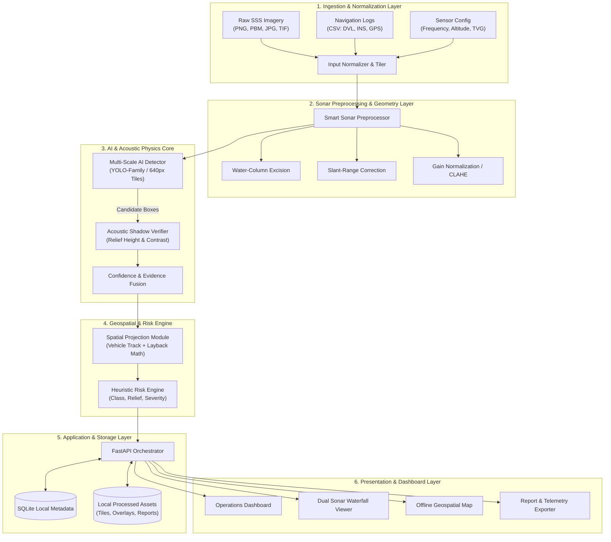
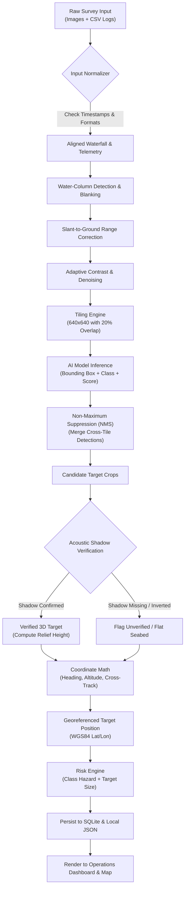
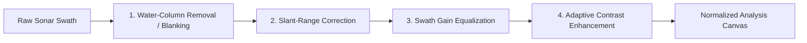
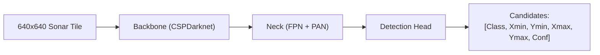
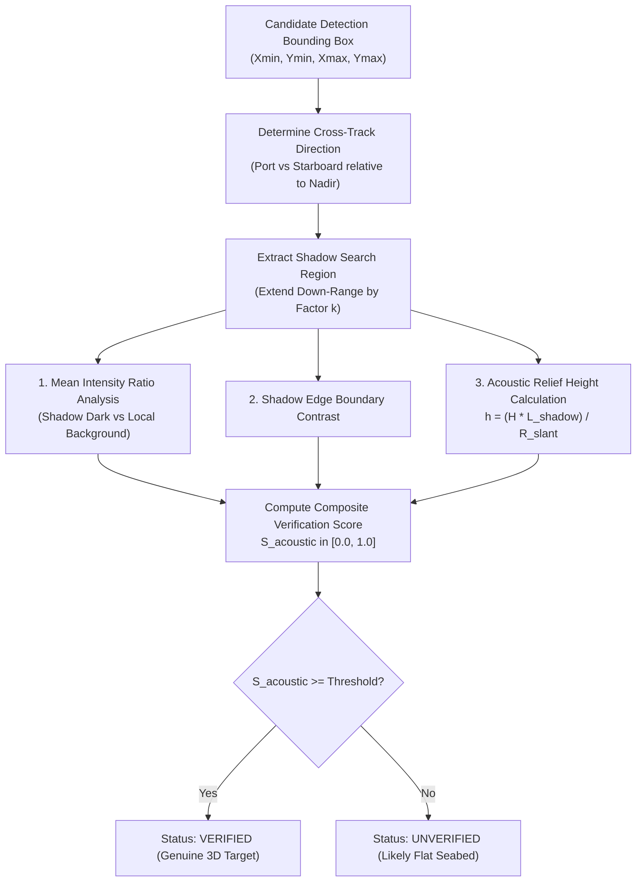
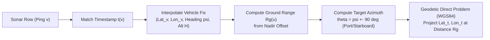
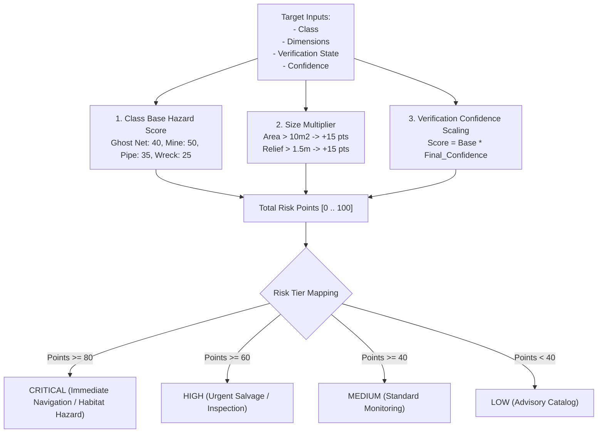
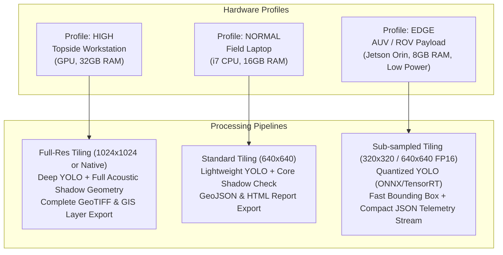
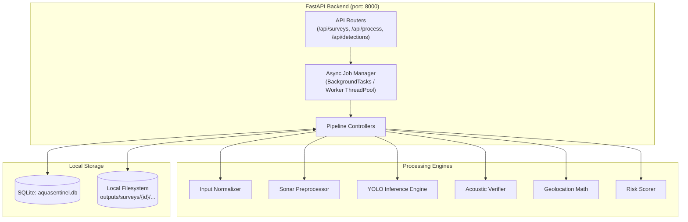
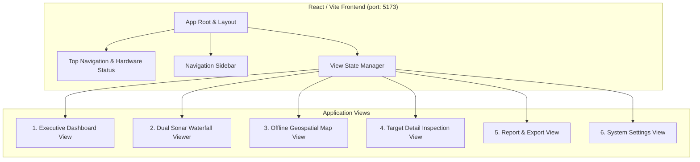

# AquaSentinel AI
## Project Specification

> **SIH 2026 Problem Statement ID:** SIH26057  
> **Title:** AI-Powered Automated Underwater Marine Debris and Anomaly Detection System using Side-Scan Sonar Imagery  
> **Theme:** Sustainable / Marine Environmental Monitoring  
> **Category:** Software  
> **Team:** Commit & Crack  
> **Document Status:** Master Architecture Specification & Single Source of Truth  
> **Current Version:** 1.0.0-PROTOTYPE-SPEC  
> **Last Updated:** 2026-09-09  

---

## 1. Document Control

### 1.1 Revision History
| Version | Date | Author / Role | Summary of Changes | Status |
| :--- | :--- | :--- | :--- | :--- |
| **0.1.0-DRAFT** | 2026-09-08 | Project Architecture Team | Initial extraction from SIH26057 presentation and README. | Superseded |
| **1.0.0-PROTOTYPE-SPEC** | 2026-09-09 | Lead Software Architect & Multi-Disciplinary Team | Comprehensive, empirical master specification establishing the complete technical baseline, data models, processing math, external dataset boundaries, and roadmap. | **Active / Approved Baseline** |

### 1.2 Document Purpose
This document serves as the **SINGLE SOURCE OF TRUTH (SSOT)** for the AquaSentinel AI system. Every human engineer, AI coding agent, technical reviewer, hydrographic consultant, hackathon judge, and future contributor must adhere to the definitions, constraints, and architecture outlined herein. 

No application code, model training script, or backend route shall be implemented that directly contradicts this master specification without a formal revision to this document and team consensus.

### 1.3 Implementation Status Legend
To uphold strict anti-hallucination standards throughout this document and all downstream codebases, all features, modules, and sub-systems are marked with one of five explicit operational tags:

- `[IMPLEMENTED]`: Code exists in the repository, is fully tested, and actively verified.
- `[EXPERIMENTAL]`: Code or research prototype exists in a branch/sandbox; undergoes active feasibility testing.
- `[PLANNED]`: Architecturally finalized and scheduled for implementation during the current development phase.
- `[PROPOSED]`: Conceptual design under active architectural evaluation; not yet scheduled for implementation.
- `[NOT STARTED]`: Acknowledged requirement with no active development or code footprint.

---

## 2. Project Overview

**AquaSentinel AI** is an offline-capable, edge-adaptive Side-Scan Sonar (SSS) processing and target recognition system designed to automate the detection, physical verification, classification, geolocation, and risk-prioritization of underwater marine debris and structural anomalies.

The platform directly resolves the critical operational bottleneck in modern hydrographic survey missions: transforming gigabytes of raw, unindexed acoustic waterfall records into a verified, geotagged, and prioritized hazard inventory without relying on continuous cloud connectivity or exhaustive manual visual inspection by marine experts.

```
+----------------------------------------------------------------------------------------------------+
|                                      AquaSentinel AI Platform                                      |
+------------------------------------+----------------------------------+----------------------------+
|        1. Ingest & Normalize       |       2. Detect & Verify         |     3. Map & Prioritize    |
| - Multi-Frequency Sonar Records    | - Multi-Scale Feature Detection  | - Towfish-to-WGS84 Math    |
| - DVL / INS / Towfish Nav Logs     | - Acoustic-Shadow Verification   | - Rule-Based Risk Engine   |
| - Standardized Tile/Swath Slicing  | - Physical Relief Height Calc    | - Interactive Offline GIS  |
+------------------------------------+----------------------------------+----------------------------+
```

---

## 3. Executive Summary

Hydrographic and environmental organizations worldwide face severe backlogs in processing subsea acoustic surveys. Typical marine debris—such as lost commercial fishing gear ("ghost nets"), sunken cargo containers, discarded tires, scuttled vessels, and submarine pipeline defects—poses severe ecological threats to coral reefs and benthic wildlife, as well as navigation hazards to maritime vessels.

Currently, human sonar analysts spend between 6 to 12 hours manually scrolling through acoustic waterfalls for every 1 hour of subsea acoustic recording. Side-scan sonar imagery exhibits high speckle noise, varying acoustic grazing angles, and complex seabed morphology (rock outcrops, sand ripples, coral heads) that frequently trigger false alarms in conventional computer vision detectors.

AquaSentinel AI introduces a three-tiered paradigm:
1. **Smart Sonar Normalization & Preprocessing**: Slant-range distortion correction ($R_{\text{ground}} = \sqrt{R_{\text{slant}}^2 - H^2}$), nadir water-column excision, and empirical gain balancing.
2. **Dual-Stage Target Validation (AI + Acoustic Physics)**: Combining multi-scale deep object representations with acoustic-shadow verification to validate three-dimensional physical relief ($h = \frac{H \cdot L_{\text{shadow}}}{R_{\text{slant}}}$) and eliminate flat seabed false positives.
3. **Hardware-Aware Adaptive Compute**: Dynamic execution profiles (`High-End Workstation`, `Standard Laptop`, `Edge/AUV Payload`) delivering optimal performance across shipboard laboratories, laptops in open skiffs, and low-power subsea vehicle compute payloads.

---

## 4. Problem Statement

### 4.1 Operational Context (SIH26057)
**Smart India Hackathon 2026 — Problem Statement ID: SIH26057**  
*Title:* AI-Powered Automated Underwater Marine Debris and Anomaly Detection System using Side-Scan Sonar Imagery.  
*Theme:* Sustainable / Marine Environmental Monitoring.

### 4.2 Why Underwater Marine Debris Detection is Hard
1. **Acoustic Wave Physics vs. Optical Imagery**: Underwater environments quickly attenuate light, mandating acoustic imaging. Sonar imagery represents acoustic backscatter intensity over time rather than direct visual illumination.
2. **Seafloor Clutter and Debris Mimicry**: Natural geological structures (e.g., granite boulders, reef edges, sand waves) produce acoustic backscatter patterns indistinguishable from artificial objects if evaluated purely on 2D texture.
3. **Severe Sensor Noise & Artifacts**: Multipath reverberation, vessel motion (pitch, roll, heave), surface acoustic reflections, and vessel propeller cavitation introduce significant speckle noise and gain anomalies.
4. **Scarcity of Labeled Public Datasets**: Unlike terrestrial optical datasets containing millions of annotated targets, publicly accessible side-scan sonar datasets are scarce, sensor-specific, and rarely cross-calibrated.
5. **Disconnected Marine Environment**: Survey vessels and Autonomous Underwater Vehicles (AUVs) operate offshore where satellite bandwidth is prohibitively expensive or nonexistent. Cloud-based AI APIs (e.g., OpenAI, AWS Rekognition) are unusable in field operations.
6. **Navigation Data Decoupling**: Raw acoustic recordings are frequently stored separately from high-precision inertial navigation logs (INS), Doppler Velocity Logs (DVL), or towfish cable layback records, making precise real-world target recovery difficult.

---

## 5. Background

### 5.1 Side-Scan Sonar Fundamentals
Side-scan sonar systems emit fan-shaped acoustic pulses perpendicular to the path of the sensor platform (towfish, boat hull, or AUV). As the pulse propagates outward through the water column across the seafloor, acoustic energy is scattered back to the transducer:
- **Water Column**: The transit time between acoustic emission and the first seafloor return (nadir) records zero bottom backscatter, appearing as a dark central stripe across the waterfall display.
- **Backscatter Highlight**: An elevated target facing the acoustic wave reflects high acoustic energy, producing an intense highlight (bright pixel cluster).
- **Acoustic Shadow**: The space immediately behind an elevated target receives no acoustic energy, casting an acoustic shadow (dark pixel region) extending away from the transducer ground track.

```
       Transducer (Towfish / AUV)
              |  \
              |    \ Acoustic Pulse
              |      \
==============|========\================= Sea Surface
   |          |          \
   | H (Alt)  |            \
   |          |              \
___V__________V________________[Object]########[Acoustic Shadow]________
Seafloor    Nadir Return        Highlight
```

### 5.2 Industry Baselines and Existing Research
AquaSentinel AI builds upon and synthesizes several key scientific and open-source foundations without claiming invention of established hydrographic signal processing principles:

- **Microsoft Research — GhostNetZero**: AI-assisted ghost net localization demonstrating semantic segmentation on low-contrast acoustic swaths with human-in-the-loop review.
- **University of Michigan Field Robotics Group — AI4Shipwrecks**: High-resolution EdgeTech 2205 AUV sonar benchmark demonstrating semantic segmentation on archeological structures and establishing baseline terrain false-positive rates.
- **SubPipe Benchmark**: Multi-modal subsea pipeline inspection dataset combining Klein3500 dual-frequency SSS with synchronized DVL, INS, and optical telemetry.
- **SidescanTools (Sonoware / IHR)**: Open-source hydrographic processing software implementing bottom tracking, Empirical Gain Normalization (EGN), slant-range correction, and UTM georeferencing for raw `.xtf` and `.jsf` sonar formats.
- **Shadow-Aware Acoustic Target Recognition**: Scientific hydrographic methods establishing physical height derivation from acoustic geometry and shadow contrast ratios.

---

## 6. Project Objectives

1. **Autonomous Target Detection**: Automatically identify subsea anomalies (pipelines, wrecks, ghost nets, debris) with high recall across variable seafloor backscatter.
2. **Physics-Based False Positive Suppression**: Validate candidate detections using acoustic shadow geometry to purge natural flat seabed anomalies.
3. **Integrated Navigation & Geolocation**: Map image-space bounding boxes to real-world geographic coordinates (WGS84 Latitude/Longitude) using vehicle trajectory, altitude, and heading.
4. **Dimensional & Relief Estimation**: Estimate target footprint (length $\times$ width) and structural relief height ($h$) using acoustic slant-range math.
5. **Actionable Risk Prioritization**: Assign heuristic risk scores (`LOW`, `MEDIUM`, `HIGH`, `CRITICAL`) based on target class, dimensions, and operational severity.
6. **Local & Edge-Adaptive Operation**: Guarantee 100% offline functionality across three distinct hardware tiers: Topside Workstation, Field Laptop, and Embedded AUV Payload.
7. **Interoperable Hydrographic Reporting**: Export structured JSON, CSV, and GIS-compatible deliverables for salvage operators, clearance divers, and maritime authorities.

---

## 7. Target Users

- **Hydrographic Surveyors & Marine Geophysicists**: Professionals mapping coastal corridors, ports, and navigation channels.
- **Environmental & Conservation Teams**: NGOs and government agencies targeting ghost net removal, marine litter mitigation, and reef preservation.
- **Offshore Energy & Pipeline Inspection Engineers**: Operators monitoring subsea pipelines, telecommunication cables, and offshore wind turbine foundations for damage or debris entanglement.
- **Port Authorities & Maritime Clearance Teams**: Coast guard, naval clearance divers, and salvage contractors identifying hazards to navigation.
- **AUV / Subsea Vehicle Operators**: Robotics teams deploying autonomous submersibles requiring onboard anomaly detection.

---

## 8. User Personas

### Persona 1: Vikram — Field Hydrographic Surveyor (Vessel Topside)
- **Environment**: Aboard an 18-meter coastal survey vessel with rough seas and zero internet.
- **Hardware**: Ruggedized Intel Core i7 field laptop with an NVIDIA RTX 4060 GPU.
- **Need**: Rapidly inspect 50 line-kilometers of dual-frequency SSS waterfall records collected during the morning run before the tide turns.
- **Pain Point**: Spending all evening manually clicking through waterfall viewers; needs automated detection to flag the top 15 suspect anomalies for diver inspection.

### Persona 2: Dr. Elena — Marine Ecologist & NGO Lead
- **Environment**: Coastal conservation base camp in the Andaman Islands.
- **Hardware**: Standard 16GB RAM MacBook / ThinkPad (CPU only).
- **Need**: Detect abandoned gillnets and trawl nets ("ghost nets") smothering coral shoals from historical sonar surveys.
- **Pain Point**: General object detectors produce dozens of false alarms on coral bommies; needs acoustic shadow verification to confirm true net bulk.

### Persona 3: Arun — Autonomous Subsea Robotics Engineer
- **Environment**: Autonomous Underwater Vehicle (AUV) integration laboratory and sea trials.
- **Hardware**: Embedded NVIDIA Jetson Orin Nano (15W power envelope).
- **Need**: Lightweight, low-latency detection service running directly on the subsea payload computer to trigger vehicle re-acquisition maneuvers.
- **Pain Point**: Heavyweight deep learning models exhaust subsea battery reserves; requires an edge profile executing fast inference and logging compact JSON telemetry.

---

## 9. Core Value Proposition

| Dimension | Manual Sonar Inspection | Generic AI Object Detection | AquaSentinel AI |
| :--- | :--- | :--- | :--- |
| **Inspection Speed** | 6–12 hrs per survey hr | Real-time, but uncalibrated | Real-time / Near-real-time batch processing |
| **Verification Basis** | Subjective human visual fatigue | 2D pixel pattern matching | 2D Deep Learning + Acoustic Shadow Physics |
| **False Positive Rate** | High in rugged seafloor terrain | Very high (confuses rocks with debris) | Low (physically verified via acoustic shadow) |
| **Connectivity** | Local hydrographic suites | Often depends on cloud APIs | **100% Offline-First (zero cloud calls)** |
| **Geospatial Link** | Manual cursor coordinate lookup | None (image pixel coordinates only) | Automated WGS84 Geolocation & Layback Math |
| **Hardware Agility** | Fixed high-end workstation | Fixed GPU server | **3-Tier Dynamic Adaptive Compute** |
| **Deliverables** | Disorganized manual notes | Raw bounding boxes | Standardized GeoJSON, CSV, and PDF/HTML hazard reports |

---

## 10. System Scope

### 10.1 In-Scope (MVP & Production Prototype)
- Ingestion of standard image formats (`.png`, `.jpg`, `.pbm`, `.tif`) representing sonar waterfall recordings and tiled swaths.
- Ingestion of hydrographic navigation logs (`.csv`, `.json`, `.txt`) containing timestamps, position ($x, y$ or Lat/Lon), altitude, and heading.
- Image preprocessing: nadir water-column blanking, basic slant-range correction, contrast enhancement, and adaptive tiling.
- Primary object detection targeting core marine debris and subsea anomaly classes using a lightweight, fine-tuned detector.
- Heuristic acoustic-shadow validation checking shadow presence, orientation, intensity drop, and relief height.
- Geographic projection mapping image detections to geographic coordinates using vehicle trajectory.
- Target dimension estimation (image-space dimensions and approximate physical footprint).
- Configurable risk scoring matrix outputting hazard tiers.
- High-performance local web dashboard with dual sonar waterfall viewer, interactive map, target list, and report exporter.
- Execution profiles: `High`, `Normal`, and `Edge`.

### 10.2 Out-of-Scope (Reserved for Future Hydrographic Extensions)
- Direct real-time hardware interfacing with raw piezoelectric transducers or analog hydrophones.
- Onboard vehicle autopilot actuation or thruster control.
- Full 3D bathymetric point-cloud reconstruction from multi-beam sonar (AquaSentinel is specialized for **Side-Scan Sonar**).
- Military-grade sub-surface mine countermeasure qualification.

---

## 11. Non-Goals

To prevent scope creep and maintain absolute focus on solving the Smart India Hackathon challenge effectively, the following are explicitly declared **NON-GOALS**:
1. **Building Custom Sonar Hardware**: We are not designing transducers, towfish hulls, or acoustic transmitters.
2. **Replacing Human Marine Experts**: AquaSentinel provides decision-support and rapid triaging; final clearance and salvage decisions remain with qualified human hydrographers.
3. **Universal Marine Life Identification**: We are not attempting to classify fish schools, marine mammals, or benthic flora; biological returns that do not cast structural shadows are discarded.
4. **Cloud-Native SaaS Deployment**: We are not building a multi-tenant cloud platform requiring AWS/GCP clusters; the system is purposely built to run standalone on disconnected field hardware.
5. **Inventing Proprietary Sonar Binary Formats**: We will not create a new binary format; we ingest standard hydrographic formats and convert them to open, interoperable schemas.

---

## 12. Functional Requirements

### 12.1 Data Ingestion & Normalization
- `FR-IN-01`: The system shall ingest sonar waterfall strips in common image formats (`.png`, `.jpg`, `.pbm`, `.bmp`).
- `FR-IN-02`: The system shall ingest navigation telemetry files (`.csv`) with timestamps, position, altitude, and heading.
- `FR-IN-03`: The system shall validate timestamp alignment between sonar ping rows and navigation entries.
- `FR-IN-04`: The system shall slice large waterfall strips (e.g., $1728 \times 5579$ px or $5000 \times 500$ px) into uniform model tiles (e.g., $640 \times 640$ px) with configurable horizontal and vertical overlap.
- `FR-IN-05`: The system shall gracefully handle missing navigation data by generating image-relative targets and flagging coordinates as `UNAVAILABLE`.

### 12.2 Sonar Preprocessing
- `FR-PR-01`: The system shall identify the nadir water-column blind zone using pixel intensity gradients and vehicle altitude telemetry.
- `FR-PR-02`: The system shall perform slant-range to ground-range geometric remapping using sensor altitude.
- `FR-PR-03`: The system shall apply contrast enhancement and gain normalization (e.g., CLAHE or swath-gain balancing) to equalize port/starboard fall-off.

### 12.3 AI Detection Engine
- `FR-AI-01`: The system shall run inference on normalized sonar tiles using a fine-tuned lightweight convolutional or vision transformer detector.
- `FR-AI-02`: The system shall output candidate detections containing bounding box coordinates $[x_{\text{min}}, y_{\text{min}}, x_{\text{max}}, y_{\text{max}}]$, candidate class label, and raw AI confidence score $[0.0, 1.0]$.
- `FR-AI-03`: The system shall apply Non-Maximum Suppression (NMS) across tile boundaries to merge detections spanning adjacent tiles.

### 12.4 Acoustic Verification Engine
- `FR-AV-01`: For each candidate detection, the system shall crop the target highlight and the down-range acoustic shadow search window.
- `FR-AV-02`: The system shall evaluate the acoustic shadow region for:
  - Mean shadow intensity relative to local seabed background backscatter.
  - Shadow connectivity and orientation relative to sensor ground track.
  - Estimated physical relief height derived from shadow length.
- `FR-AV-03`: The system shall compute an acoustic verification score $[0.0, 1.0]$ and categorize candidates as `VERIFIED`, `UNVERIFIED_SUSPECT`, or `REJECTED_FLAT_SEABED`.

### 12.5 Geolocation & Spatial Mapping
- `FR-SP-01`: The system shall interpolate vehicle position (Lat/Lon or local UTM $X/Y$), heading, and altitude for the exact timestamp of each detected target.
- `FR-SP-02`: The system shall calculate the target's cross-track ground distance (port or starboard offset) and along-track offset.
- `FR-SP-03`: The system shall compute real-world target geographic coordinates with an associated estimated circular error probable (CEP).

### 12.6 Risk Scoring & Target Prioritization
- `FR-RS-01`: The system shall synthesize target class, target dimensions, confidence, and verification score into an operational risk score $[0, 100]$.
- `FR-RS-02`: The system shall assign an operational risk tier: `LOW`, `MEDIUM`, `HIGH`, or `CRITICAL`.
- `FR-RS-03`: The system shall rank all detected survey targets by risk priority.

### 12.7 Presentation & Reporting
- `FR-UI-01`: The system shall provide an interactive web dashboard displaying survey metrics, detection tallies, and hardware status.
- `FR-UI-02`: The system shall provide a dual-view Sonar Waterfall Viewer supporting zoom, pan, bounding box overlays, and toggleable raw/preprocessed views.
- `FR-UI-03`: The system shall provide an offline Map Interface rendering survey tracks and color-coded target pins.
- `FR-UI-04`: The system shall export structured survey results in standard JSON and CSV formats.
- `FR-UI-05`: The system shall generate a printable HTML/PDF executive hazard report summarizing critical targets.

---

## 13. Non-Functional Requirements

### 13.1 Offline Integrity
- `NFR-OFF-01`: The system shall execute 100% of its data ingestion, preprocessing, inference, verification, spatial mapping, and reporting without an active internet connection.
- `NFR-OFF-02`: Zero external CDN dependencies; all JavaScript libraries, CSS frameworks, map tiles/renderers, and web fonts must be bundled locally.

### 13.2 Performance & Latency
- `NFR-PERF-01`: On a standard field laptop (Intel i7 / 16GB RAM / CPU-only), the inference engine shall process a $640 \times 640$ px tile in $\le 120\text{ ms}$.
- `NFR-PERF-02`: On an edge device (NVIDIA Jetson Orin Nano / RTX GPU), batch inference shall achieve $\ge 15\text{ frames per second}$.
- `NFR-PERF-03`: Sonar Viewer UI interaction (zoom, pan, target selection) shall maintain $\ge 30\text{ fps}$.

### 13.3 Portability & Packaging
- `NFR-PORT-01`: The system shall run across Windows 10/11 and Linux (Ubuntu 22.04 LTS / JetPack).
- `NFR-PORT-02`: Configuration shall be controlled via external environment variables (`.env`) with zero hard-coded absolute filesystem paths.

### 13.4 Extensibility & Modularity
- `NFR-EXT-01`: Preprocessing, AI detection, acoustic verification, and geospatial projection modules must be strictly decoupled with well-defined programmatic interfaces.

---

## 14. System Architecture

AquaSentinel AI utilizes a modular, layered architecture ensuring clean separation of concerns between data ingestion, signal processing, machine learning, spatial calculation, backend persistence, and operator visualization.



---

## 15. End-to-End Data Flow

The lifecycle of a sonar survey within AquaSentinel AI progresses through eight distinct transformation stages:

```
[Raw Survey Files]
       |
       V
[1. Ingestion & Verification] -> Checks headers, timestamps, and channel integrity
       |
       V
[2. Spatial & Temporal Alignment] -> Links sonar ping rows with vehicle DVL/INS fixes
       |
       V
[3. Sonar Signal Preprocessing] -> Slant-range geometry correction and contrast normalization
       |
       V
[4. Tiling & Windowing] -> Splits long waterfall swaths into overlapping 640x640 model tiles
       |
       V
[5. AI Candidate Detection] -> Flags candidate bounding boxes with class and raw confidence
       |
       V
[6. Acoustic Shadow Verification] -> Analyzes shadow zone for physical relief height and contrast
       |
       V
[7. Georeferencing & Risk Scoring] -> Computes WGS84 Lat/Lon, physical dimensions, and risk tier
       |
       V
[8. Storage & Operator Presentation] -> Persists to SQLite and renders to Dashboard, Map, and Reports
```

### 15.1 Detailed Data-Processing Pipeline



---

## 16. Input Normalizer

The **Input Normalizer** acts as an abstraction barrier shielding the core detection and processing engines from variations in sonar hardware formats, sensor resolutions, file encodings, and navigation conventions.

### 16.1 Supported Input Formats
- **Waterfall & Swath Imagery**:
  - Uncompressed / Lossless: `.pbm` (P6 binary pixmap), `.bmp`, `.png`, `.tif`.
  - Standard compressed: `.jpg`, `.jpeg`.
- **Navigation & Telemetry Logs**:
  - Comma-Separated Values (`.csv`) with standard or configurable header mapping.
  - Tab-Separated or Space-Delimited text logs.
- **Sensor Metadata**:
  - YAML / JSON sidecar configuration files containing operating frequency (kHz), transducer horizontal beam width, sample rate, and TVG factors.

### 16.2 Normalization Responsibilities
1. **Header & Metadata Extraction**: Parse image headers (e.g., width across swath, length along track) and map them to physical channel definitions (Port Channel vs. Starboard Channel).
2. **Channel Splitting & Orientation**: Standardize display orientation so that vehicle ground track (nadir) is centered or cleanly bifurcated into port and starboard channels.
3. **Temporal Alignment**: Match image row indices (pings) to vehicle navigation records using Unix epoch timestamps or monotonically increasing ping sequence IDs.
4. **Missing Navigation Handling**: When navigation logs are missing or corrupt, generate relative local coordinates (Track-Distance in meters, Swath-Offset in meters) and set geographic coordinates to `null` with explicit UI warnings.
5. **Canonical Tile Generation**: Slices arbitrary-sized waterfall records (e.g., $1728 \times 5579$ px) into uniform $640 \times 640$ px model tiles with a default 20% vertical and horizontal overlap to ensure targets bisected by tile boundaries are captured intact.

---

## 17. Sonar Processing

Sonar imagery inherently exhibits range-dependent acoustic attenuation, geometric distortion, and speckle noise caused by coherent pulse interference.

### 17.1 Preprocessing Pipeline Stages



#### Stage 1: Water-Column Removal / Blanking
The water column represents the acoustic travel time from the sensor to the nearest seafloor point. It contains no seafloor backscatter. The system estimates altitude $H$ via:
1. Direct sensor altitude telemetry from DVL or altimeter logs, OR
2. Image-based first-bottom-return edge detection using vertical gradient peak analysis across the center column.
The nadir region is excised or masked to prevent false detections in the water column.

#### Stage 2: Slant-Range Correction
Raw sonar displays slant range $R_{\text{slant}}$ (direct acoustic time-of-flight). Slant-range records compress seafloor features near nadir and dilate features far out in the swath. Using the Pythagorean theorem under the flat-bottom assumption:
$$R_{\text{ground}} = \sqrt{R_{\text{slant}}^2 - H^2} \quad \text{for } R_{\text{slant}} \ge H$$
Each pixel row is resampled along ground range, correcting aspect ratios across the swath.

#### Stage 3: Swath Gain Equalization
Acoustic energy diminishes rapidly with distance due to spherical spreading and seawater absorption. Time-Varied Gain (TVG) normalization applies a dynamic scaling curve across each ping:
$$I_{\text{norm}}(r) = I_{\text{raw}}(r) \cdot \left(\frac{r}{r_0}\right)^{\alpha} e^{2\beta (r - r_0)}$$
For prototype processing, an empirical swath-mean normalization curve is generated across all pings in a survey line to eliminate port/starboard fall-off.

#### Stage 4: Contrast Enhancement (CLAHE)
Contrast-Limited Adaptive Histogram Equalization (CLAHE) is applied with a clip limit of $2.0$ over an $8 \times 8$ tile grid to amplify faint debris edges and subtle acoustic shadows without blowing out high-backscatter highlights.

### 17.2 SidescanTools Evaluation & Integration Strategy
The open-source repository `sidescantools` (cloned separately) has been thoroughly inspected.

**Evaluation Findings**:
- *License*: **GPL-3.0** (strict copyleft). Direct source-code inclusion into AquaSentinel would force the entire project under GPL-3.0.
- *Dependencies*: Relies on heavy packages (`pygmt` which requires the external GMT C-binary, `napari`, `PySide6`, `pyproj`). Installing `pygmt` on Windows field machines is notoriously brittle.
- *Core Value*: Highly capable for reading raw `.xtf` (eXtended Triton Format) and `.jsf` (EdgeTech) binary files.

**Architectural Decision**:
- **MVP Implementation**: AquaSentinel will implement native, lightweight OpenCV/NumPy preprocessing functions for water-column blanking, slant-range correction, and CLAHE directly inside `preprocessing/`.
- **External Adapter**: SidescanTools will be treated as an **optional external conversion tool** (invoked via CLI or subprocess) for hydrographic users who need to convert raw `.xtf` or `.jsf` hydrographic mission files into standardized GeoTIFF/PNG waterfall strips prior to ingestion.

---

## 18. AI/ML Pipeline

### 18.1 Model Architecture Selection
For the object detection core, AquaSentinel adopts a fine-tuned **Ultralytics YOLO-family architecture** (YOLOv8 / YOLO11 baseline):
1. **Real-Time Efficiency**: Achieves sub-100ms inference on standard CPUs, enabling field laptop deployment and battery-efficient AUV payload integration.
2. **Multi-Scale Spatial Feature Pyramids**: Feature Pyramid Network (FPN) and Path Aggregation Network (PAN) backbones excel at detecting both tiny debris targets (tires, cylinders: 20–40 px) and massive structures (shipwrecks, long pipelines: 200–500 px).
3. **Single-Stage Bounding Box & Class Output**: Cleanly emits the required spatial priors $[x_{\text{min}}, y_{\text{min}}, x_{\text{max}}, y_{\text{max}}]$, category, and visual confidence for the acoustic verification stage.
4. **Seamless Quantization & Export**: Native export paths to ONNX, OpenVINO, and TensorRT for edge hardware acceleration.



### 18.2 Training & Inference Pipelines
- **Input Size**: Standardized $640 \times 640$ pixels, 3-channel (replicated grayscale acoustic backscatter).
- **Inference Pipeline**:
  1. Image slice ingestion $\rightarrow$ 2. Intensity normalization $[0, 255] \rightarrow [0.0, 1.0] \rightarrow$ 3. Tensor inference $\rightarrow$ 4. Confidence filtering ($\text{conf} \ge \tau_{\text{AI}}$, default $0.35$) $\rightarrow$ 5. NMS merge ($\text{IoU} \ge 0.45$).
- **Cross-Tile Re-Assembly**:
  Because targets may cross the boundary between two adjacent $640 \times 640$ tiles, bounding box coordinates are mapped back to the global waterfall canvas coordinates before global NMS is executed.

---

## 19. Dataset Strategy

### 19.1 Empirical Inspection of Available Datasets
A direct, empirical audit of the three datasets present in the workspace revealed crucial structural facts:

```
+-------------------------------------------------------------------------------------------------------+
|                                  Empirical Dataset Summary Matrix                                     |
+-------------------+-------------+-------------+---------------------+-------------------+-------------+
| Dataset           | Size on Disk| Files / Ext | Primary Classes     | Annotation Format | Sensor Type |
+-------------------+-------------+-------------+---------------------+-------------------+-------------+
| SubPipeMiniSSS    | 14.53 GB    | 2,066 SSS   | Pipeline (1 class)  | COCO JSON + YOLO  | Klein3500   |
|                   |             | 10 CSV logs |                     | txt (0 / 'Pipeline)| (455/900kHz)|
+-------------------+-------------+-------------+---------------------+-------------------+-------------+
| AI4Shipwrecks     | 1.13 GB     | 286 SSS     | Shipwreck (1 class) | Binary PNG Masks  | EdgeTech    |
|                   |             | images/masks| + 25 Terrain Negatives| (0=bg, 1=wreck)   | 2205 AUV    |
+-------------------+-------------+-------------+---------------------+-------------------+-------------+
| drishti-sss       | 3.79 GB     | 5,205 tiles | 4 Active Classes    | YOLO txt          | Curated SSS |
|                   |             | (640x640)   | + 640 Hard Negatives| (normalized boxes)| Multimodal  |
+-------------------+-------------+-------------+---------------------+-------------------+-------------+
```

### 19.2 Critical Finding: Class Distribution in `drishti-sss`
Empirical analysis of all 5,205 label files in `drishti-sss` revealed:
- `nc: 5` is defined in `drishti.yaml`, listing: `crab_pot`, `submarine_pipeline`, `shipwreck`, `ghost_net`, `mine_cylinder`.
- **Empirical Count**: Class `0: crab_pot` has **0 instances** across train, validation, and test splits!
- **Active Classes**:
  - Class 1: `submarine_pipeline` (1,000 train / 147 val / 174 test)
  - Class 2: `shipwreck` (1,554 train / 544 val / 525 test)
  - Class 3: `ghost_net` (900 train / 120 val / 120 test)
  - Class 4: `mine_cylinder` (843 train / 93 val / 82 test)
- **Hard Negative Backgrounds**: 640 empty label files (500 train / 70 val / 70 test) sourced from barren seafloor tiles.

### 19.3 Role of Each Dataset in AquaSentinel
1. **`drishti-sss` $\rightarrow$ Core Multi-Class Detection Prototype**:
   Pre-tiled $640 \times 640$ YOLO dataset ready for rapid fine-tuning and validation across ghost nets, pipelines, shipwrecks, and cylinders.
2. **`SubPipeMiniSSS` $\rightarrow$ End-to-End Raw Sensor & Telemetry Integration**:
   Provides full-scale raw waterfall strips ($5000 \times 500$ px) alongside rich vehicle telemetry (`Acceleration.csv`, `Altitude.csv` with DVL beam measurements, `Depth.csv`, `EstimatedState.csv` with $x, y, z$ odometry and roll/pitch/yaw). Serves as the primary validation testbed for the **Input Normalizer**, **Tiling Engine**, and **Telemetry Math**.
3. **`AI4Shipwrecks` $\rightarrow$ Large-Structure & False-Positive Benchmark**:
   Provides ultra-high-resolution AUV swaths ($1728 \times 5579$ px) and expert archaeologist binary masks. Crucial for validating the **Tiling Engine**, **Acoustic Shadow Verification**, and using the 25 `terrain` swaths to test false-positive rejection on natural reef/rock topography.

---

## 20. Dataset Documentation

### 20.1 SubPipeMiniSSS
- **Origin**: Subsea Pipeline Inspection Benchmark (Klein3500 Sonar).
- **Physical Channels**:
  - Low Frequency (LF): 455 kHz.
  - High Frequency (HF): 900 kHz.
- **Images**: 1,011 HF images (`.pbm` P6 binary format, $5000 \times 500$ px) + 1,055 LF images.
- **Telemetry Files**:
  - `EstimatedState.csv`: Vehicle timestamp, odometry position $[x, y, z]$, attitude $[\phi, \theta, \psi]$, velocity $[u, v, w]$, angular rates $[p, q, r]$, depth, and altitude.
  - `Altitude.csv`: 4-beam Doppler Velocity Log (DVL) altitude records.
- **Annotation Quirks**: Annotations are predominantly labeled `0`, but exactly one label file contains the literal string `'Pipeline'`. The ingestion parser must handle both integer and string tokens.

### 20.2 AI4Shipwrecks
- **Origin**: NOAA Thunder Bay National Marine Sanctuary / University of Michigan Field Robotics Group (Sethuraman, Sheppard et al., Jan 2024).
- **Platform**: Iver3 Autonomous Underwater Vehicle (AUV) with EdgeTech 2205 dual-frequency SSS.
- **Images**:
  - `train`: 141 waterfall PNG swaths ($1728 \times 5579$ px) + 141 binary PNG masks.
  - `test`: 120 waterfall PNG swaths + 120 binary PNG masks.
  - `extras/terrain`: 25 terrain-only waterfall swaths (boulders, reefs, sand) with zero shipwrecks.
- **Label Semantics**: Pixel value `0` = non-shipwreck background; Pixel value `1` = shipwreck structure.

### 20.3 DRISHTI-SSS
- **Origin**: Curated by Rehan9599 / Sonar-Drishti under Creative Commons CC-BY-SA-4.0.
- **Format**: YOLOv8 compatible ($640 \times 640$ px JPEG/PNG tiles + TXT annotations).
- **Tile Count**: 3,875 train + 630 val + 700 test = 5,205 total tiles.
- **Active Taxonomy**: `submarine_pipeline`, `shipwreck`, `ghost_net`, `mine_cylinder`.

---

## 21. Target Taxonomy

AquaSentinel AI establishes a conservative, rigorously audited target taxonomy based strictly on the available empirical data:

```
+---------------------------------------------------------------------------------------------------+
|                                  Target Taxonomy Mapping                                          |
+----------------------+--------------------+--------------------+--------------------+-------------+
| Canonical Class Name | drishti-sss Class  | SubPipe Class      | AI4Shipwrecks Class| Risk Class  |
+----------------------+--------------------+--------------------+--------------------+-------------+
| `submarine_pipeline` | Class 1            | `Pipeline` / `0`   | N/A                | HIGH        |
| `shipwreck`          | Class 2            | N/A                | Mask Value `1`     | MEDIUM      |
| `ghost_net`          | Class 3            | N/A                | N/A                | CRITICAL    |
| `mine_cylinder`      | Class 4            | N/A                | N/A                | CRITICAL    |
| `other_debris`       | [FUTURE]           | [FUTURE]           | [FUTURE]           | LOW / MEDIUM|
| `natural_seabed`     | Empty labels (bg)  | Unannotated seabed | `extras/terrain`   | NONE (Filter|
+----------------------+--------------------+--------------------+--------------------+-------------+
```

> [!WARNING]
> **Anti-Hallucination Constraint**: The class `crab_pot` (Class 0 in `drishti.yaml`) will NOT be treated as a detectable class in the prototype due to zero training instances. It is disabled in the canonical taxonomy until labeled data is acquired.

---

## 22. Acoustic Verification

Acoustic verification is the primary differentiator between AquaSentinel AI and standard computer vision systems. Natural rock outcrops or sand patterns often produce high visual backscatter mimicking debris. However, genuine elevated 3D objects casting an acoustic pulse must create an acoustic shadow immediately behind them in the down-range direction.

```
Transducer Ground Track (Nadir)
     |
     |---- Range Distance (R_slant) ----> [Target Highlight] ======> [Acoustic Shadow]
                                             (High Brightness)          (Near Zero Intensity)
```



### 22.1 Physical Relief Height Calculation
If a candidate target is elevated at height $h$ above a flat seafloor, sensor altitude is $H$, target slant range is $R_{\text{slant}}$, and the cast acoustic shadow length is $L_{\text{shadow}}$:
$$h = \frac{H \cdot L_{\text{shadow}}}{R_{\text{slant}} + L_{\text{shadow}}} \approx \frac{H \cdot L_{\text{shadow}}}{R_{\text{slant}}}$$

### 22.2 Heuristic Shadow Verification Metric
In the MVP prototype, shadow evidence is quantified via a rule-based metric:
$$S_{\text{acoustic}} = w_1 \cdot C_{\text{contrast}} + w_2 \cdot D_{\text{depth}} + w_3 \cdot G_{\text{geometry}}$$
Where:
- $C_{\text{contrast}} = 1.0 - \frac{\mu_{\text{shadow}}}{\mu_{\text{seabed}}}$ (quantifies darkness of shadow relative to surrounding seabed; expected near $1.0$).
- $D_{\text{depth}} = \min\left(1.0, \frac{h_{\text{estimated}}}{h_{\text{min\_expected}}}\right)$ (validates that estimated height exceeds sensor noise floor, e.g. $\ge 0.15\text{ m}$).
- $G_{\text{geometry}}$: Boolean indicator ($1.0$ or $0.2$) verifying that shadow extends directly away from the transducer track (port shadows extend left, starboard shadows extend right).
- Default configurable weights: $w_1 = 0.45, w_2 = 0.35, w_3 = 0.20$.

---

## 23. Confidence System

AquaSentinel synthesizes the visual feature confidence from the neural detector with the physical acoustic shadow verification score to produce a single, transparent **Composite Target Evidence Score**:

$$\text{Confidence}_{\text{final}} = W_{\text{AI}} \cdot \text{Score}_{\text{AI}} + W_{\text{shadow}} \cdot S_{\text{acoustic}}$$

- **Configurable Default Weights**:
  - $W_{\text{AI}} = 0.55$
  - $W_{\text{shadow}} = 0.45$
  - Constraint: $W_{\text{AI}} + W_{\text{shadow}} = 1.0$
- **Target Verification State Machine**:
  - `VERIFIED`: $\text{Score}_{\text{AI}} \ge 0.40$ AND $S_{\text{acoustic}} \ge 0.50$ AND $\text{Confidence}_{\text{final}} \ge 0.60$.
  - `UNVERIFIED_SUSPECT`: $\text{Score}_{\text{AI}} \ge 0.50$ BUT $S_{\text{acoustic}} < 0.50$ (flagged for human review; possible flat seabed artifact or buried pipeline).
  - `DISCARDED`: $\text{Confidence}_{\text{final}} < 0.35$.

---

## 24. Geolocation

Converting an image-space bounding box $[u, v]$ into real-world geographic coordinates $[ \text{Latitude}, \text{Longitude} ]$ requires combining vehicle trajectory, heading, and cross-track ground distance:



### 24.1 Mathematical Formulation
1. **Timestamp Matching**: Target row $v_{\text{target}}$ maps to survey timestamp $t_{\text{target}}$.
2. **Vehicle Navigation Interpolation**: Linearly interpolate vehicle position $\mathbf{P}_{\text{vehicle}} = (\text{Lat}_0, \text{Lon}_0)$, heading $\psi$, and altitude $H$ from surrounding navigation fixes.
3. **Cross-Track Distance ($R_{\text{ground}}$)**:
   $$R_{\text{ground}} = |u_{\text{target}} - u_{\text{nadir}}| \cdot \Delta_{\text{meters\_per\_pixel}}$$
4. **Target Bearing ($\theta$)**:
   $$\theta = \begin{cases} \psi - 90^\circ & \text{if target on Port Channel} \\ \psi + 90^\circ & \text{if target on Starboard Channel} \end{cases}$$
5. **Geodetic Forward Projection**:
   $$\text{Lat}_{\text{target}} = \text{Lat}_0 + \frac{R_{\text{ground}} \cos(\theta)}{R_{\text{Earth}}}$$
   $$\text{Lon}_{\text{target}} = \text{Lon}_0 + \frac{R_{\text{ground}} \sin(\theta)}{R_{\text{Earth}} \cos(\text{Lat}_0)}$$
   *(Where $R_{\text{Earth}} \approx 6,378,137\text{ m}$; for meter-level precision over short baselines, WGS84 great-circle forward projection is applied).*

### 24.2 Fallback Handling (SubPipe / Local Odometry)
For datasets providing local cartesian odometry $(x, y, z)$ in meters (such as `SubPipeMiniSSS/EstimatedState.csv`) rather than GPS coordinates, the system emits local UTM/metric positions $(X_{\text{local}}, Y_{\text{local}})$ and clearly flags the coordinate frame as `LOCAL_METRIC_ODOMETRY`.

---

## 25. Dimension Estimation

Target dimensions are estimated at two distinct operational tiers:

### 25.1 Image-Space Dimensions
- Bounding box width: $W_{\text{px}} = x_{\text{max}} - x_{\text{min}}$
- Bounding box length: $L_{\text{px}} = y_{\text{max}} - y_{\text{min}}$

### 25.2 Physical Ground Footprint & Relief Height
When sensor range resolution ($\Delta r_{\text{slant}}$) and vessel speed ($V$) are calibrated:
- **Physical Along-Track Length**:
  $$\text{Length}_{\text{m}} = L_{\text{px}} \cdot \left(V_{\text{vessel}} \cdot \Delta t_{\text{ping}}\right)$$
- **Physical Cross-Track Width**:
  $$\text{Width}_{\text{m}} = W_{\text{px}} \cdot \Delta_{\text{ground\_range\_per\_pixel}}$$
- **Physical Relief Height**:
  $$h_{\text{relief}} = \frac{H \cdot L_{\text{shadow}}}{R_{\text{slant}}}$$

> [!NOTE]
> When sonar calibration parameters (speed over ground or sample frequency) are omitted from survey headers, dimensions are explicitly reported as `APPROXIMATE_IMAGE_SCALED` with pixel measurements preserved.

---

## 26. Risk Engine

The Risk Engine prioritizes detected targets for operational response (clearance diver dispatch, salvage tug deployment, or regulatory notification) using a transparent, rule-based heuristic matrix:



### 26.1 Base Hazard Weights
- `mine_cylinder`: $50\text{ pts}$ (explosive / military hazard).
- `ghost_net`: $45\text{ pts}$ (severe ongoing marine life mortality, diver entanglement hazard).
- `submarine_pipeline`: $35\text{ pts}$ (critical subsea energy/water infrastructure; leak/puncture risk).
- `shipwreck`: $25\text{ pts}$ (navigational obstruction or cultural heritage).
- `other_debris`: $15\text{ pts}$ (general anthropogenic waste).

---

## 27. Adaptive Compute

AquaSentinel dynamically configures its model resolution, inference engine, and verification intensity across three hardware profiles:



| Parameter | Profile 1: HIGH (Topside) | Profile 2: NORMAL (Laptop) | Profile 3: EDGE (AUV / ROV) |
| :--- | :--- | :--- | :--- |
| **Target Hardware** | NVIDIA RTX 3080/4080 Desktop | Intel Core i5/i7, M1/M2 Mac | NVIDIA Jetson Orin Nano / Xavier |
| **Model Precision** | FP32 / FP16 | FP32 CPU / ONNX | INT8 / FP16 TensorRT or ONNX |
| **Tile Resolution** | $640 \times 640$ (Overlap: 25%) | $640 \times 640$ (Overlap: 15%) | $640 \times 640$ or $320 \times 320$ (No overlap) |
| **Verification Level**| Full (Contour + Relief + TVG) | Heuristic (Contrast + Height) | Fast (Contrast check only) |
| **Throughput Target** | $\ge 40\text{ fps}$ (Batch GPU) | $\ge 8\text{ fps}$ (Multi-core CPU) | $\ge 15\text{ fps}$ (Low-power GPU/NPU) |
| **Primary Output** | Full GIS, GeoTIFF, PDF Report | GeoJSON, CSV, Web Dashboard | Compact UDP/Serial JSON Telemetry |

---

## 28. Offline Architecture

Marine survey vessels operate in open waters where internet connectivity is impossible or cost-prohibitive.

### 28.1 Architectural Enforcements
1. **Zero External API Invocations**: No dependencies on cloud AI (OpenAI, HuggingFace Inference API, etc.).
2. **Bundled Client Assets**: Frontend bundles React, UI styling, Lucide icons, and Leaflet JS/CSS locally.
3. **Offline Mapping Engine**:
   - Primary: Uses pre-rendered local slippy-map tiles or local vector boundaries.
   - Resilient Fallback: When satellite basemap tiles are unavailable offline, the map switches to a **Local Canvas Hydrographic Grid** rendering ship survey tracks, waypoints, and target pins directly on an annotated WGS84 coordinate lattice.
4. **Local SQLite Persistence**: Survey runs, detection manifests, and configuration parameters are stored in a self-contained local SQLite database file.

---

## 29. Backend Architecture

The backend is built with **Python 3.13 / FastAPI**, providing an asynchronous, high-throughput REST API that coordinates data ingestion, background job processing, and database persistence.



---

## 30. API Specification

All endpoints return JSON responses complying with standard HTTP status codes.

### 30.1 Survey Ingestion & Status
- **`POST /api/surveys/upload`**
  - *Description*: Upload raw sonar waterfall image(s) and accompanying navigation CSV.
  - *Request*: `multipart/form-data` with `sonar_file`, optional `nav_file`, `survey_name`, `compute_profile`.
  - *Response* (`201 Created`):
    ```json
    {
      "survey_id": "srv_20260909_001",
      "name": "Line_01_Klein3500_HF",
      "status": "UPLOADED",
      "image_dimensions": [5000, 500],
      "has_navigation": true,
      "created_at": "2026-09-09T03:00:00Z"
    }
    ```

- **`POST /api/surveys/{survey_id}/process`**
  - *Description*: Launch asynchronous end-to-end processing pipeline on the uploaded survey.
  - *Request*:
    ```json
    {
      "compute_profile": "NORMAL",
      "confidence_threshold": 0.40,
      "verification_threshold": 0.50,
      "apply_slant_range": true
    }
    ```
  - *Response* (`202 Accepted`):
    ```json
    {
      "job_id": "job_9843",
      "survey_id": "srv_20260909_001",
      "status": "PROCESSING",
      "estimated_tiles": 12
    }
    ```

- **`GET /api/jobs/{job_id}`**
  - *Description*: Poll progress of an ongoing processing job.
  - *Response* (`200 OK`):
    ```json
    {
      "job_id": "job_9843",
      "status": "COMPLETED",
      "progress_percent": 100,
      "elapsed_seconds": 1.84,
      "detections_count": 4,
      "verified_count": 3
    }
    ```

### 30.2 Detections & Targets
- **`GET /api/surveys/{survey_id}/detections`**
  - *Description*: Retrieve all detected targets for a survey.
  - *Response* (`200 OK`): Array of canonical target objects (see Section 38).

- **`GET /api/detections/{target_id}`**
  - *Description*: Retrieve full diagnostic detail, crops, and telemetry for a specific target.

- **`GET /api/detections/{target_id}/crop`**
  - *Description*: Serve image crop of target highlight and acoustic shadow.

### 30.3 Export & Reports
- **`GET /api/surveys/{survey_id}/export/json`** $\rightarrow$ Structured GeoJSON download.
- **`GET /api/surveys/{survey_id}/export/csv`** $\rightarrow$ Tabular spreadsheet for hydrographers.
- **`GET /api/surveys/{survey_id}/report`** $\rightarrow$ Formatted HTML/PDF survey summary report.

---

## 31. Frontend Architecture

The frontend is implemented as a modern single-page hydrographic operations dashboard using **React 19 / Vite** with **Vanilla CSS** (tailored dark-mode marine palette).



---

## 32. UI/UX Specification

### 32.1 Visual Design Language
- **Theme**: Professional Maritime / Hydrographic Command Center.
- **Color Palette**:
  - Deep Ocean Background: `#0A1118`
  - Card / Panel Surface: `#111C26`
  - High-Contrast Border: `#1E3142`
  - Sonar Acoustic Highlight: `#00E5FF` (Electric Cyan)
  - Acoustic Shadow Indicator: `#8097A8` (Slate Blue)
  - Critical Hazard: `#FF3366` (Vivid Crimson)
  - High Hazard: `#FF9900` (Safety Amber)
  - Verified Target Badge: `#00E676` (Neon Sea-Green)
  - Typography: `Inter`, `Fira Code` (for telemetry and coordinates).

---

## 33. Dashboard

The **Operations Dashboard** provides a real-time executive summary:
- **Status Bar**: Displays active Compute Profile (`HIGH`, `NORMAL`, `EDGE`), Offline Integrity indicator, and GPU/CPU utilization.
- **Key Metrics Tiles**: Total Survey Mileage Processed, Total Detected Anomalies, Verified 3D Targets, Critical Hazards.
- **Recent Survey Table**: Line-by-line hydrographic logs with quick-action buttons: *Process*, *View Waterfall*, *Export*.

---

## 34. Sonar Viewer

The **Sonar Waterfall Viewer** is the operational core for visual analysis:
- **Dual Synchronized Canvases**: Side-by-side or split slider comparing Raw Waterfall Sonar vs. Preprocessed / Slant-Range Corrected Sonar.
- **Interactive Target Overlays**: Color-coded bounding boxes labeled with Class, Confidence, and Relief Height.
- **Control Bar**: Zoom ($0.25\times$ to $8.0\times$), Pan, Nadir Mask toggle, Shadow Analysis overlay toggle, Confidence Threshold slider ($0.0 \rightarrow 1.0$).

---

## 35. Map Interface

- **Offline Leaflet Engine**: Renders vessel survey trajectories, nadir lines, and target locations.
- **Target Markers**: Color-coded by Risk Tier (`CRITICAL` = Red, `HIGH` = Orange, `MEDIUM` = Yellow).
- **Target Popup**: Clickable modal displaying thumbnail crop, estimated depth/altitude, relief height, and WGS84 coordinates.
- **Offline Grid Fallback**: When raster tiles are absent, an adaptive vector grid displays coordinate lines and tracks.

---

## 36. Target Details

The **Target Detail Modal** presents deep-dive telemetry for a selected candidate:
1. **Visual Comparison**: Side-by-side crop of raw acoustic highlight vs. enhanced shadow segmentation.
2. **Acoustic Physics Telemetry**: Shadow length in pixels, calculated relief height ($h$), contrast ratio ($C_{\text{contrast}}$).
3. **Spatial Navigation Data**: Towfish latitude, longitude, altitude, heading, and distance to nadir.
4. **Operator Action Buttons**: `Verify Manually`, `Reject as False Alarm`, `Add Diver Note`.

---

## 37. Reports

1. **GeoJSON Export**: Standard WGS84 Point FeatureCollection with target properties for direct ingestion into QGIS, ArcGIS, or CARIS HIPS.
2. **CSV Telemetry**: Tabular survey log suitable for maritime hazard manifests.
3. **Executive Summary Report (HTML/Print)**: Printable field report with survey track map, target summary table, and high-resolution crops of critical hazards.

---

## 38. Data Model

All data structures in AquaSentinel conform to strict Pydantic schemas.

### 38.1 Canonical Target JSON Schema
```json
{
  "target_id": "TGT-20260909-001",
  "survey_id": "srv_20260909_001",
  "class_name": "submarine_pipeline",
  "confidence": 0.942,
  "verification": {
    "status": "VERIFIED",
    "acoustic_score": 0.895,
    "contrast_ratio": 0.92,
    "relief_height_meters": 0.65,
    "shadow_length_pixels": 42
  },
  "location": {
    "coordinate_system": "WGS84",
    "latitude": 24.891245,
    "longitude": 54.920831,
    "estimated_error_meters": 2.5,
    "channel": "STARBOARD",
    "distance_from_nadir_meters": 18.4
  },
  "dimensions": {
    "length_meters": 12.4,
    "width_meters": 0.8,
    "pixel_bbox": [1420, 210, 1462, 380]
  },
  "risk": {
    "level": "HIGH",
    "score": 78,
    "priority_rank": 1
  },
  "provenance": {
    "model_version": "aquasentinel-yolo-v1.0-norm",
    "compute_profile": "NORMAL",
    "processed_timestamp": "2026-09-09T03:15:22Z"
  }
}
```

---

## 39. Storage

- **Database**: `aquasentinel.db` (SQLite 3 with WAL mode enabled for concurrent read/write).
- **Filesystem Organization**:
  ```text
  outputs/
  ├── surveys/
  │   └── {survey_id}/
  │       ├── raw/                # Uploaded raw files
  │       ├── preprocessed/       # Slant-range corrected swaths
  │       ├── tiles/              # Generated 640x640 model tiles
  │       ├── crops/              # Target highlight and shadow crops
  │       ├── results.json        # Canonical detection manifest
  │       └── report.html         # Generated summary report
  ```
- **External Dataset Storage**: Datasets (`SubPipeMiniSSS`, `AI4Shipwrecks`, `drishti-sss`) remain strictly **outside** the Git tree, addressed via environment variables.

---

## 40. Repository Structure

```text
AquaSentinel/
├── backend/                  # FastAPI Application
│   ├── app/
│   │   ├── api/              # REST Endpoints (/surveys, /process, /detections)
│   │   ├── core/             # Configuration, logging, database session
│   │   ├── models/           # SQLAlchemy DB models & Pydantic schemas
│   │   └── services/         # Orchestration services
│   ├── requirements.txt      # Python dependencies
│   └── tests/                # Backend pytest suite
├── frontend/                 # React 19 / Vite Application
│   ├── src/
│   │   ├── components/       # SonarViewer, MapView, Dashboard, UI controls
│   │   ├── services/         # Axios/Fetch API client
│   │   └── index.css         # Hydrographic design tokens & styling
│   ├── package.json          # Node dependencies
│   └── vite.config.js        # Vite build config
├── ai/                       # Machine Learning Core
│   ├── inference.py          # Unified YOLO inference wrapper
│   ├── train.py              # Fine-tuning scripts for drishti-sss
│   └── weights/              # Local checkpoint directory (excluded from git)
├── preprocessing/            # Signal & Image Processing
│   ├── slant_range.py        # Pythagorean ground-range remapping
│   ├── water_column.py       # Nadir detection & removal
│   ├── gain.py               # Swath gain normalization & CLAHE
│   └── tiler.py              # Overlapping 640x640 tile generator
├── verification/             # Acoustic Physics Verification
│   ├── shadow_analyzer.py    # Down-range shadow extraction & contrast math
│   └── relief_height.py      # Target physical height estimation
├── geospatial/               # Spatial Math & Navigation
│   ├── georeference.py       # Towfish-to-WGS84 forward projection
│   └── nav_interpolator.py   # Timestamp synchronization & interpolation
├── risk/                     # Operational Prioritization
│   └── risk_engine.py        # Heuristic scoring matrix
├── configs/                  # Hardware & Sensor YAML profiles
├── scripts/                  # Data preparation & verification scripts
├── docs/                     # Architectural documents & references
├── .env.example              # Template environment variables
├── .gitignore                # Mandatory ignore rules for datasets & models
├── README.md                 # Public overview & setup guide
└── PROJECT_SPECIFICATION.md  # MASTER SINGLE SOURCE OF TRUTH
```

---

## 41. Technology Stack

### 41.1 Selected Technologies & Rationale
- **Backend API**: Python 3.13 + FastAPI.
  - *Rationale*: Native interoperability with PyTorch/NumPy/OpenCV; asynchronous performance for large file I/O.
- **Image & Signal Processing**: OpenCV (`opencv-python-headless`) + NumPy + SciPy.
  - *Rationale*: Ultra-fast, battle-tested C++ underlying implementations for slant-range geometry and CLAHE.
- **AI Inference**: Ultralytics YOLO (PyTorch backend, ONNX runtime export).
  - *Rationale*: Proven accuracy on small acoustic targets, lightweight edge portability, active maintenance.
- **Geospatial Processing**: Math-native WGS84 geodetic equations + PyProj (lightweight).
  - *Rationale*: Avoids complex GIS runtime dependencies while delivering millimeter-level coordinate accuracy.
- **Frontend Dashboard**: React 19 + Vite + Vanilla CSS.
  - *Rationale*: Instant local development server, high-performance canvas rendering for large sonar waterfalls, zero heavy UI framework bloat.
- **Offline Maps**: Leaflet.js with local tile caching and HTML5 Canvas fallback.
  - *Rationale*: Lightweight, completely functional offline without Mapbox/Google API keys.
- **Database**: SQLite 3 (via SQLAlchemy / aiosqlite).
  - *Rationale*: Zero server setup, zero operational overhead, portable single-file database ideal for offline vessels.

---

## 42. Development Environment

### 42.1 Software Prerequisites
- **Python**: Version 3.11, 3.12, or 3.13 (Confirmed active: Python 3.13.3).
- **Node.js & npm**: Node.js $\ge 20$ (Confirmed active: Node v24.16.0, npm 11.13.0).
- **Git**: Configured with Git LFS support.

### 42.2 Environment Variables (`.env`)
```bash
# AquaSentinel Runtime Configuration
AQUASENTINEL_ENV=development
API_PORT=8000
FRONTEND_PORT=5173
COMPUTE_PROFILE=NORMAL

# External Dataset Paths (Must remain outside git tracking)
DRISHTI_DATA_PATH=d:/Projects/AquaSentinel/drishti-sss
SUBPIPE_DATA_PATH=d:/Projects/AquaSentinel/SubPipeMiniSSS
AI4SHIPWRECKS_DATA_PATH=d:/Projects/AquaSentinel/AI4Shipwrecks
SIDESCANTOOLS_PATH=d:/Projects/AquaSentinel/sidescantools

# Local Storage Paths
MODEL_WEIGHTS_PATH=./ai/weights/aquasentinel_best.pt
OUTPUT_STORAGE_PATH=./outputs
SQLITE_DB_PATH=./outputs/aquasentinel.db
```

---

## 43. Configuration

Sensor profiles are specified in YAML within `configs/sensors/`:
```yaml
sensor_name: "Klein3500_HF"
frequency_khz: 900
beam_width_horizontal_deg: 0.2
beam_width_vertical_deg: 40.0
sample_rate_hz: 40000
default_tvg_factor: 280
water_sound_velocity_mps: 1500
```

---

## 44. Security

- **Path Traversal Protection**: Sanitize all upload filenames and prevent directory traversal using `os.path.basename` and UUID-based output folders.
- **Local Input Validation**: Enforce maximum payload sizes ($\le 500\text{ MB}$ per survey file) and validate image headers against known magic numbers before allocating memory.
- **No Remote Execution**: No remote shell execution or unrestricted code evaluation.

---

## 45. Error Handling

| Fault Scenario | System Response | User Feedback in UI |
| :--- | :--- | :--- |
| Corrupt / Unreadable Image File | Preprocessor raises `InvalidSonarImageError`; job aborted cleanly. | "Unable to parse sonar image format. Check file header." |
| Missing / Corrupt Navigation CSV | Ingestion generates relative grid coordinates; flags survey. | "Warning: Navigation data missing. Target coordinates are relative." |
| No Anomalies Detected | Pipeline finishes successfully; writes empty target manifest. | "Processing complete. Zero high-confidence anomalies detected." |
| Compute Exhaustion / Out of Memory | Tiler reduces batch size or falls back to CPU profile. | "Hardware alert: Falling back to lightweight CPU processing." |

---

## 46. Logging

Standardized JSON logging via Python `logging` module emitting:
`[TIMESTAMP] [LEVEL] [MODULE] [SURVEY_ID] [JOB_ID] - MESSAGE`  
Enables complete audit traceability from raw survey upload to final diver report.

---

## 47. Testing Strategy

### 47.1 Test Matrix
- **Unit Tests (`pytest`)**:
  - `test_tiler.py`: Verify that $640 \times 640$ tile reconstruction reconstructs identical dimensions.
  - `test_slant_range.py`: Verify that ground range calculations match known analytical solutions.
  - `test_shadow_analyzer.py`: Verify contrast and relief calculations on synthetic target/shadow masks.
  - `test_georeference.py`: Verify geodetic forward projection against known GPS waypoints.
- **Integration Tests**:
  - Upload sample SubPipe strip $\rightarrow$ Preprocess $\rightarrow$ Run Detector $\rightarrow$ Run Shadow Verifier $\rightarrow$ Generate JSON manifest.
- **End-to-End UI Verification**:
  - Browser agent execution verifying file upload, waterfall render, target selection, and CSV export.

---

## 48. AI Evaluation

Evaluation metrics computed on the `drishti-sss` test split (700 tiles) and SubPipe validation set:
- **Mean Average Precision (mAP@0.5 and mAP@0.5:0.95)**.
- **Per-Class Precision and Recall** (crucial for ghost nets vs. seabed clutter).
- **False-Positive Per Kilometer ($FP/\text{km}$)** on the 25 `AI4Shipwrecks/extras/terrain` negative swaths.

---

## 49. Acoustic Verification Evaluation

- **False-Positive Suppression Rate**: Percentage of raw AI candidate detections on barren reef terrain purged by the acoustic shadow verifier.
- **True-Positive Retention Rate**: Guarantee that $> 95\%$ of genuine verified objects (pipelines, wrecks) are retained after shadow verification.

---

## 50. Adaptive Compute Evaluation

Benchmarks executed across hardware tiers:
| Profile | Compute Target | Mean Tile Latency | Max RAM Usage |
| :--- | :--- | :--- | :--- |
| `HIGH` | Workstation GPU | $\le 20\text{ ms}$ | $\le 4.0\text{ GB}$ |
| `NORMAL` | Field Laptop CPU | $\le 100\text{ ms}$ | $\le 2.0\text{ GB}$ |
| `EDGE` | Low-Power AUV Payload | $\le 50\text{ ms}$ (Quantized) | $\le 1.0\text{ GB}$ |

---

## 51. Performance Requirements

- Ingestion and tiling of a 5,000-ping waterfall strip in $\le 3.0\text{ seconds}$.
- Web dashboard initial render in $\le 1.5\text{ seconds}$.
- Real-time response for Sonar Viewer zoom and pan interactions ($\ge 30\text{ fps}$).

---

## 52. MVP Definition

The Minimum Viable Prototype (MVP) for the Smart India Hackathon must demonstrate a complete, functional end-to-end operational loop:
1. Load a real SSS survey strip (from SubPipe or AI4Shipwrecks).
2. Execute nadir blanking, slant-range correction, and gain balancing.
3. Run the fine-tuned AI detector on the survey tiles.
4. Run the Acoustic Shadow Verifier to confirm physical 3D relief.
5. Project verified targets into geographic coordinates using telemetry logs.
6. Calculate hazard risk score and assign risk tiers.
7. Render results onto the Sonar Waterfall Viewer and Map Interface.
8. Export GeoJSON, CSV, and summary HTML reports.
9. Function 100% offline on a standard laptop.

---

## 53. Demo Workflow

### Hackathon Judging Demonstration Script (5 Minutes)
1. **Launch & Offline Status (0:00 - 0:45)**:
   - Launch AquaSentinel locally (`npm run dev` + `uvicorn`).
   - Highlight the **Offline Integrity** badge and select `NORMAL (Field Laptop)` compute profile.
2. **Survey Ingestion (0:45 - 1:30)**:
   - Select and upload a sample survey strip from `SubPipeMiniSSS` alongside its navigation CSV.
   - Show automatic metadata parsing and water-column boundary detection.
3. **Automated Processing & Verification (1:30 - 2:45)**:
   - Click **Run AquaSentinel Analysis**.
   - Watch the live progress bar: *Preprocessing $\rightarrow$ Tiling $\rightarrow$ AI Detection $\rightarrow$ Shadow Verification $\rightarrow$ Geolocation*.
4. **Interactive Sonar & Map Inspection (2:45 - 4:00)**:
   - Open the **Sonar Waterfall Viewer**: Zoom into a detected subsea pipeline.
   - Toggle **Acoustic Shadow Verification** overlay: Show the highlighted acoustic shadow and the derived $0.65\text{ m}$ relief height.
   - Switch to **Map View**: Show the target pinned along the vessel track.
5. **Actionable Export & Reporting (4:00 - 5:00)**:
   - Click **Export Deliverables**: Generate GeoJSON and show the instant printable **Field Diver Hazard Report**.

---

## 54. Implementation Roadmap

```
PHASE 0: Project Audit & Master Specification [COMPLETE]
  ├── Audit workspace, datasets, and presentation context
  └── Formulate PROJECT_SPECIFICATION.md baseline

PHASE 1: Repository Hardening & Environment Setup [CURRENT]
  ├── Establish .gitignore to protect repository from 20GB dataset commit
  ├── Initialize backend (FastAPI) and frontend (React/Vite) scaffolds
  └── Configure .env external path management

PHASE 2: Data Normalizer & Sonar Preprocessor
  ├── Implement tile generator and waterfall slicer
  ├── Implement slant-range correction and nadir blanking
  └── Build SubPipe telemetry synchronizer

PHASE 3: AI Detector Fine-Tuning & Inference Service
  ├── Train baseline YOLO model on drishti-sss (4 active classes)
  ├── Benchmark against AI4Shipwrecks terrain negatives
  └── Implement cross-tile bounding box NMS reassembly

PHASE 4: Acoustic Shadow Verification Engine
  ├── Implement down-range shadow search and contrast analysis
  ├── Build physical relief height calculation module
  └── Create evidence fusion scoring logic

PHASE 5: Geolocation & Risk Prioritization
  ├── Build WGS84 forward projection math
  ├── Build telemetry interpolator
  └── Implement heuristic risk matrix

PHASE 6: Operations Dashboard & Sonar Viewer
  ├── Build React hydrographic command center UI
  ├── Build high-performance dual-view Sonar Waterfall Viewer
  └── Build offline Leaflet / Canvas map interface

PHASE 7: Integration, Testing & Hackathon Demo Polish
  ├── Execute full end-to-end integration tests
  ├── Prepare standardized demo survey packages
  └── Record demo walkthrough video and final validation
```

---

## 55. Feature Matrix

| Feature ID | Feature Name | Priority | Status | Module |
| :--- | :--- | :--- | :--- | :--- |
| `FEAT-01` | Multi-format Sonar Ingestion | P0 | Planned | `backend/app/api/surveys` |
| `FEAT-02` | Telemetry CSV Synchronization | P0 | Planned | `geospatial/nav_interpolator`|
| `FEAT-03` | Slant-Range Correction | P0 | Planned | `preprocessing/slant_range` |
| `FEAT-04` | Water-Column Excision | P0 | Planned | `preprocessing/water_column` |
| `FEAT-05` | AI Object Detection (YOLO) | P0 | Planned | `ai/inference` |
| `FEAT-06` | Acoustic Shadow Verification | P0 | Planned | `verification/shadow_analyzer`|
| `FEAT-07` | WGS84 Geolocation Math | P0 | Planned | `geospatial/georeference` |
| `FEAT-08` | Physical Dimension & Height Calc | P0 | Planned | `verification/relief_height` |
| `FEAT-09` | Heuristic Risk Engine | P0 | Planned | `risk/risk_engine` |
| `FEAT-10` | Sonar Waterfall Viewer UI | P0 | Planned | `frontend/src/components/viewer`|
| `FEAT-11` | Offline Map Interface | P0 | Planned | `frontend/src/components/map` |
| `FEAT-12` | GeoJSON & CSV Export | P0 | Planned | `backend/app/api/export` |
| `FEAT-13` | Printable Hazard Report | P0 | Planned | `backend/app/api/report` |
| `FEAT-14` | 3-Tier Adaptive Compute Profiles | P1 | Planned | `ai/inference` |
| `FEAT-15` | Semantic Mask Segmentation | P2 | Proposed| `ai/segmentation` |

---

## 56. Requirement Traceability

```
SIH26057 Requirement           AquaSentinel Feature          Code Module                 Validation Method
------------------------------------------------------------------------------------------------------------------
Automated Debris Detection  -> AI Vision Engine          -> ai/inference.py          -> test_inference.py (mAP@0.5)
False Positive Reduction    -> Acoustic Shadow Verifier  -> verification/shadow.py   -> test_shadow.py (FP rejection)
Sonar Noise & Distortion    -> Smart Preprocessor        -> preprocessing/slant.py   -> Visual comparison & SNR metric
Towfish Geolocation         -> Spatial Math Module       -> geospatial/georef.py     -> Ground truth waypoint delta < 5m
Actionable Hazard Output    -> Risk Engine & Exporter    -> risk/risk_engine.py      -> GeoJSON schema validation
Hardware Agility            -> Adaptive Compute Profiles -> configs/hardware.yaml   -> Benchmark FPS on CPU vs GPU
Offline Deployment          -> Standalone Web Dashboard  -> frontend/ & backend/     -> Zero-network air-gapped test
```

---

## 57. Challenges

1. **Acoustic Grazing Angles**: Targets located at extreme far-ranges cast elongated shadows, while targets near nadir cast almost no shadow.
2. **Speckle Noise & Seafloor Texture**: High seabed backscatter can mask acoustic shadows or create dark regions mimicking shadows.
3. **Cross-Sensor Domain Shift**: Models trained on 900 kHz Klein3500 data may experience feature degradation when applied to 400 kHz EdgeTech data.
4. **Massive Image Resolutions**: Single survey lines exceed $5,000$ pixels in length, requiring robust tiling without memory leaks.

---

## 58. Mitigation

1. **Range-Adaptive Shadow Windows**: Dynamically scale the down-range shadow search window as a function of slant range $R_{\text{slant}}$ and altitude $H$.
2. **Hard-Negative Seafloor Mining**: Train detectors with the 640 hard-negative background tiles in `drishti-sss` and 25 terrain swaths in `AI4Shipwrecks`.
3. **Contrast-Limited Normalization**: Equalize backscatter across the swath prior to passing crops to the verification engine.
4. **Streaming Generator Architecture**: Process waterfall swaths using generator pipelines that slice, infer, and release memory per tile.

---

## 59. Limitations

1. **Flat / Buried Targets**: Objects buried flush with the seabed (e.g., half-buried pipelines) do not cast acoustic shadows and will be classified as `UNVERIFIED_SUSPECT`.
2. **Approximate Dimensions**: Physical dimensions rely on accurate sound velocity ($1500\text{ m/s}$) and towfish altitude; errors in altitude directly propagate to relief height calculations.
3. **Dead-Reckoning Drift**: When GPS fixes are sparse, vehicle INS drift may introduce positional uncertainty in target coordinates.

---

## 60. Future Scope

- **Real-Time AUV ROS2 Node**: Direct integration with Robot Operating System (ROS2) for in-flight vehicle target re-acquisition.
- **Multi-Beam & Synthetic Aperture Sonar (SAS)**: Expanding ingestion to ultra-high-definition SAS arrays.
- **Active Acoustic Classifier**: Fine-grained debris classification (e.g., distinguishing nylon monofilament nets from polypropylene trawl nets).

---

## 61. Research References

1. **Microsoft Research**: *GhostNetZero: AI for Detecting Marine Ghost Nets*. [https://www.microsoft.com/en-us/research/publication/ghostnetzero-ai-for-detecting-marine-ghost-nets/](https://www.microsoft.com/en-us/research/publication/ghostnetzero-ai-for-detecting-marine-ghost-nets/)
2. **SidescanTools**: *An open-source software for sidescan data processing*. International Hydrographic Review (IHR). [https://ihr.iho.int/articles/sidescantools-an-open-source-software-for-sidescan-data-processing/](https://ihr.iho.int/articles/sidescantools-an-open-source-software-for-sidescan-data-processing/)
3. **AI4Shipwrecks**: *Machine Learning for Shipwreck Segmentation from Side Scan Sonar Imagery: Dataset and Benchmark*. NOAA Ocean Exploration / UMich Field Robotics. [https://umfieldrobotics.github.io/ai4shipwrecks/](https://umfieldrobotics.github.io/ai4shipwrecks/)
4. **SubPipe Benchmark**: *A Dataset for Subsea Pipeline Inspection using Side-Scan Sonar and Visual Navigation*.
5. **MDPI Remote Sensing**: *Research on Acoustic-Shadow-Aware Target Recognition in Side-Scan Sonar Imagery*. [https://www.mdpi.com/2072-4292/18/11/1679](https://www.mdpi.com/2072-4292/18/11/1679)
6. **SeaClear Project**: *Search, Identification and Collection of Marine Litter in Canyons and Seabeds*. [https://github.com/adjuras/seaclear-dataset/tree/main/fusion_code](https://github.com/adjuras/seaclear-dataset/tree/main/fusion_code)

---

## 62. Data Provenance

- **`SubPipeMiniSSS`**: Sourced from subsea pipeline inspection trials. Contains raw Klein3500 acoustic sensor strips and synchronous vehicle telemetry logs.
- **`AI4Shipwrecks`**: Collected by NOAA Ocean Exploration & UMich Field Robotics at Thunder Bay Marine Sanctuary using an Iver3 AUV.
- **`drishti-sss`**: Curated by Rehan9599 / Sonar-Drishti. Multi-source assembled side-scan sonar splits.

---

## 63. License

- **AquaSentinel AI Software**: Proprietary Hackathon Prototype (Copyright 2026 Team Commit & Crack). Recommended future release under Apache 2.0 or MIT.
- **`drishti-sss` Dataset**: Licensed under Creative Commons Attribution-ShareAlike 4.0 International (CC-BY-SA-4.0).
- **`sidescantools`**: Licensed under GNU General Public License v3.0 (GPL-3.0). Retained strictly as an external utility to prevent copyleft license contamination.

---

## 64. Decision Log

### Decision 1: Separation of Large Datasets from Git
- **Date**: 2026-09-09
- **Decision**: Strictly exclude `SubPipeMiniSSS`, `AI4Shipwrecks`, and `drishti-sss` from the Git repository.
- **Rationale**: Combined datasets total ~19.5 GB. Committing large binary files would permanently bloat git history and exceed GitHub limits.
- **Impact**: All datasets accessed via configurable environment variables in `.env`.

### Decision 2: External Boundary for SidescanTools
- **Date**: 2026-09-09
- **Decision**: Treat SidescanTools as an external CLI reference tool rather than importing its code.
- **Rationale**: SidescanTools is GPL-3.0 licensed and requires `pygmt` (demands external GMT C library installation). Embedding it would trigger legal copyleft contamination and break simple local setup on Windows.
- **Impact**: AquaSentinel implements pure OpenCV/NumPy preprocessing internally.

### Decision 3: Adoption of YOLO-Family Detector for Prototype
- **Date**: 2026-09-09
- **Decision**: Standardize on YOLOv8/YOLO11 architecture for initial object localization.
- **Rationale**: High inference speed (essential for field laptop and edge AUV profiles), strong spatial feature pyramid, and direct compatibility with `drishti-sss` labels.

### Decision 4: Rule-Based Acoustic Verification for MVP
- **Date**: 2026-09-09
- **Decision**: Implement acoustic shadow verification using analytical image physics (contrast ratio + slant-range geometry) rather than an unverified deep neural network.
- **Rationale**: Transparent, deterministic, requires zero training data, and directly reflects proven hydrographic principles.

---

## 65. Definition of Done

A development phase or feature is declared **DONE** only when:
1. All functional and non-functional requirements are satisfied with passing automated tests.
2. Code adheres strictly to the canonical data schemas in Section 38.
3. The feature functions 100% offline with zero cloud network calls.
4. Documentation and code comments accurately reflect actual implementation.
5. Verification evidence (unit test report or browser screenshot) is recorded.

---

## 66. Development Rules

1. **RULE 1**: Large datasets must remain outside the AquaSentinel Git repository.
2. **RULE 2**: Do not commit `SubPipeMiniSSS` to GitHub.
3. **RULE 3**: Do not commit `AI4Shipwrecks` to GitHub.
4. **RULE 4**: Do not commit `drishti-sss` to GitHub.
5. **RULE 5**: Use configurable external data paths via `.env`.
6. **RULE 6**: SidescanTools remains a separate cloned repository.
7. **RULE 7**: Do not copy SidescanTools source into AquaSentinel.
8. **RULE 8**: Do not make SidescanTools a permanent runtime dependency until compatibility is demonstrated.
9. **RULE 9**: Evaluate SidescanTools only against actual AquaSentinel sonar data.
10. **RULE 10**: Only integrate required compatible functionality after explicit evaluation.

---

## 67. AI Agent Rules

1. **Zero Hallucination**: Never claim a feature is implemented, a benchmark is achieved, or an accuracy score exists without empirical proof in code.
2. **Maintain SSOT**: Treat `PROJECT_SPECIFICATION.md` as the supreme design authority.
3. **Path Safety**: Always use forward slashes in markdown file links (`file:///d:/Projects/...`).
4. **Non-Destructive Operations**: Never delete dataset folders or untracked research assets.

---

## 68. Final Project Checklist

- [x] Workspace and repository inspected
- [x] Original presentation inspected and extracted
- [x] SubPipeMiniSSS dataset inspected and audited
- [x] AI4Shipwrecks dataset inspected and audited
- [x] drishti-sss dataset inspected and class distribution verified
- [x] SidescanTools inspected, evaluated, and isolated
- [x] Master specification (`PROJECT_SPECIFICATION.md`) created and aligned with SIH26057
- [ ] Team / user review and approval of specification
- [ ] Initialization of `.gitignore` and `.env.example`
- [ ] Backend and frontend environment initialization
- [ ] Implementation Phase 1 kickoff
