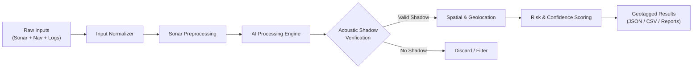
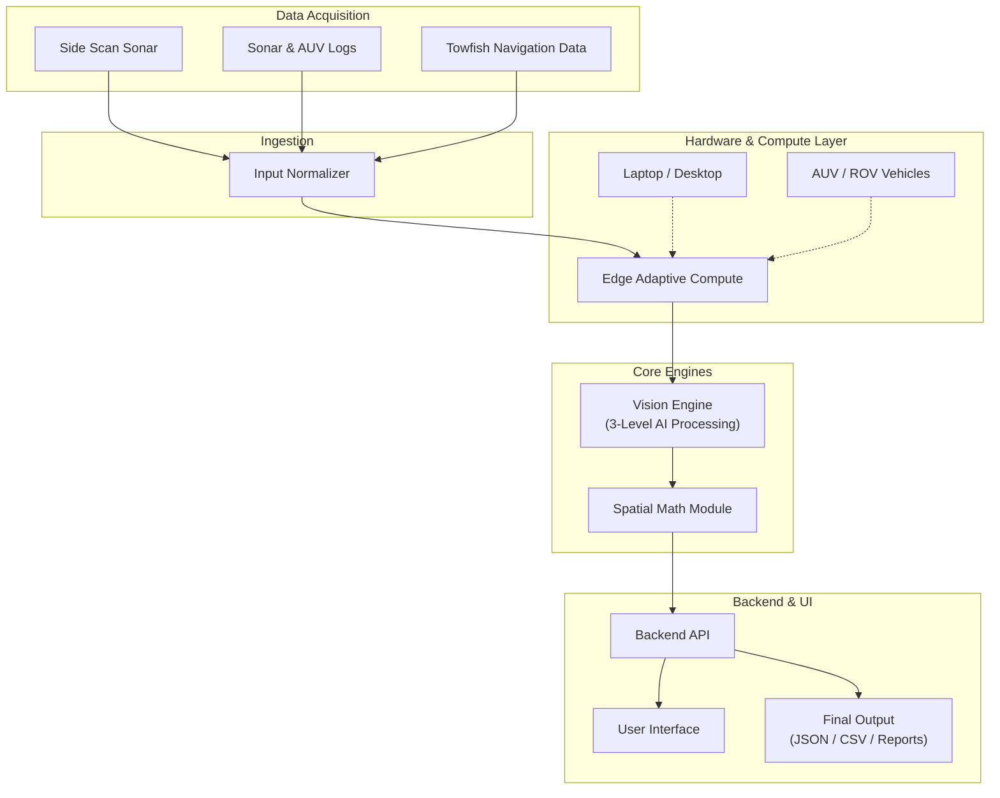

# AquaSentinel AI

**AI-Powered Automated Underwater Marine Debris and Anomaly Detection System using Side-Scan Sonar Imagery**

[](https://www.sih.gov.in/)
[](https://www.sih.gov.in/)
[](#)
[](#)
[](#)
[](#3-offline-first-architecture)

---

## Project Information

| Parameter | Details |
| :--- | :--- |
| **Hackathon** | Smart India Hackathon 2026 |
| **Problem Statement ID** | SIH26057 |
| **Problem Statement** | AI-Powered Automated Underwater Marine Debris and Anomaly Detection System using Side-Scan Sonar Imagery |
| **Theme** | Sustainable / Marine Environmental Monitoring |
| **Category** | Software |
| **Team Name** | Commit & Crack |

---

## Overview

**AquaSentinel AI** is an offline-capable, AI-powered Side-Scan Sonar (SSS) analysis system designed to automatically detect, verify, classify, and geotag underwater marine debris and structural anomalies.

> [!IMPORTANT]
> **Single Source of Truth Document**: For complete architectural specifications, dataset audit findings, data schemas, API definitions, acoustic shadow physics math, and implementation roadmaps, consult [PROJECT_SPECIFICATION.md](file:///d:/Projects/AquaSentinel/PROJECT_SPECIFICATION.md).


Sonar surveys generate massive acoustic waterfall records that are slow and difficult to inspect manually. Natural seafloor formations (rocks, coral outcrops, sand ridges) often resemble artificial debris, leading to high false-positive rates. AquaSentinel AI addresses this challenge by fusing raw acoustic imagery with navigation telemetry and acoustic physics:

* **Side-Scan Sonar (SSS) Imagery:** Dual-channel acoustic backscatter recordings.
* **Navigation & Telemetry Data:** Surface GPS, AUV/ROV inertial navigation (INS/DVL), and towfish metadata (layback, altitude, attitude).
* **Survey Logs:** Time-synchronized hydrographic run-sheets and sound velocity parameters.
* **AI Detection & Segmentation:** Multi-scale feature extraction for candidate localization.
* **Acoustic Shadow Verification:** Physical validation using acoustic shadow geometry to purge false positives.
* **Spatial & Geolocation Processing:** Rigorous projection math mapping sensor coordinates to geographic coordinates.
* **Confidence & Risk Scoring:** Actionable hazard ratings for prioritizing cleanup operations.

---

## Key Features

### 1. Adaptive Compute
AquaSentinel AI is designed to scale its AI models and processing pipelines according to the available hardware profile:
* **High-End Workstations (Topside / Office):** Executes full multi-scale deep detection, dense segmentation masks, and full-resolution spatial analysis.
* **Standard Laptops (Field Operations):** Runs optimized inference pipelines providing bounding-box localization, core shadow verification, and coordinate tagging.
* **Low-End / Edge Devices (AUV / ROV Payloads):** Executes lightweight, detection-only processing tailored for power- and compute-constrained embedded boards.

> [!NOTE]
> **Why this matters for field deployment:** Subsea vehicles (AUVs/ROVs) operate under strict power and thermal envelopes. Adaptive compute allows lightweight onboard detection during missions, while topside workstations can run comprehensive post-survey analysis on the same software platform.

### 2. Multi-Source Input
The system supports a conceptual ingestion pipeline accepting:
* Raw side-scan sonar waterfall recordings and image tiles
* Hydrographic survey logs and mission metadata
* Surface vessel GPS / GNSS navigation data
* Subsurface AUV / ROV inertial navigation logs
* Towfish layback, altitude, and heading telemetry

### 3. Offline-First Architecture
Marine surveys take place in offshore waters with little to no internet connectivity. AquaSentinel AI operates completely locally on edge hardware with zero external cloud dependencies.

### 4. Smart Sonar Processing
Acoustic data is subject to noise and distortion. The proposed preprocessing pipeline includes:
* **Water-Column Removal:** Automatic detection and excision of the nadir water-column blind zone.
* **Slant-Range Correction:** Conversion of slant-range time data to true horizontal ground-range distances:
  $$R_{\text{ground}} = \sqrt{R_{\text{slant}}^2 - H^2}$$
* **Image Enhancement & Gain Normalization:** Time-Varied Gain (TVG) and empirical gain normalization across the acoustic swath.
* **Adaptive Denoising:** Speckle noise attenuation while preserving target boundary edges.

### 5. AI + Acoustic Verification
To prevent natural seabed features from triggering false alarms:
1. **Primary AI Detection:** Deep neural representations flag candidate targets.
2. **Acoustic Shadow Verification:** Objects elevated above the seafloor cast an acoustic shadow directly behind them. AquaSentinel AI analyzes the presence, sharpness, and length of this shadow to physically verify genuine three-dimensional objects (e.g., ghost nets, containers, pipelines) and reject flat seabed texture variations.

### 6. Geolocation and Risk Mapping
Detection results are integrated with navigation metadata to calculate:
* **Target Coordinates:** Real-world WGS84 geographic positions (Latitude, Longitude).
* **Target Dimensions:** Estimated physical footprint and relief height derived from shadow length:
  $$h = \frac{H \times L_{\text{shadow}}}{R_{\text{slant}}}$$
* **Confidence & Risk Level:** Composite score and hazard classification (`Low`, `Medium`, `High`, `Critical`) for cleanup prioritization.

#### Example Output Format
```json
{
  "target_id": "SUB-8021",
  "class": "Pipeline Anomaly",
  "confidence": 0.962,
  "location": [24.89, 54.92],
  "dimensions": "1.4m x 0.8m",
  "risk_level": "High"
}
```
*(Proposed example output format for downstream reporting and telemetry integration.)*

---

## System Workflow



### Pipeline Stages
1. **Input Normalization:** Ingests and synchronizes sonar frames with navigation timestamps.
2. **Sonar Preprocessing:** Excises water column, corrects slant-range geometry, and normalizes acoustic gains.
3. **AI Processing:** Detects candidate anomalies and extracts spatial bounding masks.
4. **Acoustic Verification:** Validates object height and presence via shadow geometry.
5. **Spatial / Geolocation:** Translates image offsets into true WGS84 coordinates using towfish telemetry.
6. **Risk & Confidence Scoring:** Assigns operational hazard ratings and confidence indices.
7. **Actionable Outputs:** Exports telemetry for GIS layers, databases, and mission reports.

---

## System Architecture



---

## Technical Approach

> [!IMPORTANT]
> **Technology stack will be finalized during implementation.**

The proposed technical approach is organized into modular components:

* **Data Ingestion:** Ingests multi-channel acoustic records and synchronous telemetry streams.
* **Input Normalization:** Resamples disparate sample rates and aligns pings with navigation fixes.
* **Sonar Preprocessing:** Applies water-column removal, slant-range correction, and gain normalization.
* **AI Detection / Segmentation:** Proposed multi-scale deep learning models for anomaly localization and segmentation.
* **Acoustic-Shadow Verification:** Physical validation evaluating shadow length and contrast behind targets.
* **Spatial Processing & Geotagging:** Translates towfish position, heading, and swath offsets to geographic coordinates.
* **Confidence / Risk Scoring:** Synthesizes visual confidence, shadow geometry, and hazard type.
* **Output Generation:** Emits structured JSON, tabular CSV, and spatial mapping files.

---

## System Outputs

* **Detection & Classification:** Identifies target classes (Ghost Nets, Containers, Tires, Pipelines, Debris).
* **Segmentation Masks:** Delineates boundaries of non-rigid or dispersed debris.
* **Confidence Score:** Statistical verification metric (0.0 to 1.0).
* **Target Dimensions:** Estimated length, width, and acoustic relief height.
* **Risk Score / Level:** Operational priority tier (`Low`, `Medium`, `High`, `Critical`).
* **Approximate Coordinates:** Real-world WGS84 geographic coordinates.
* **JSON / CSV Telemetry:** Structured records for GIS and mission databases.
* **Maps and Reports:** Visual hazard maps and summary survey reports.

---

## Feasibility and Viability

### Technical Feasibility
* **Established Baselines:** Built on proven computer vision methodologies and standard hydrographic signal processing.
* **Modular Architecture:** Preprocessing, inference, and spatial math modules can be developed and tuned independently.
* **Offline Capability:** Completely local execution removes dependencies on network connectivity.
* **Edge Optimization:** Scalable architectures support quantized, lightweight inference on constrained platforms.

### Operational Viability
* **Field Deployment:** Capable of running directly onboard survey vessels or inside AUVs.
* **Reduced Overhead:** Eliminates expensive offshore satellite bandwidth requirements.
* **Low Hardware Footprint:** Standard laptops can execute core detection and verification tasks.
* **Multi-Sensor Compatibility:** Normalized input abstraction allows integration with various sonar manufacturers.
* **Actionable Geotagging:** Coordinates are immediately usable by divers and salvage teams.

---

## Challenges and Mitigation Strategies

| Challenge | Operational Risk | Proposed Mitigation |
| :--- | :--- | :--- |
| **High Sonar Noise & Distortion** | Speckle noise and attenuation obscure target boundaries. | Adaptive noise filtering and empirical gain normalization across the swath. |
| **Seafloor Debris Mimicry** | Rocks and reefs trigger false alarms in vision models. | Acoustic shadow feature analysis to verify 3D height profile. |
| **Scarcity of Sonar Datasets** | Limited labeled underwater sonar imagery available. | Transfer learning, domain adaptation, and synthetic data augmentation. |
| **Complex Seabed False Positives** | Rugged topography causes visual clutter. | Hard-negative mining and strict dual-stage confidence thresholds. |

---

## Implementation Roadmap

| Phase | Phase Name | Planned Deliverables |
| :---: | :--- | :--- |
| **1** | **Dataset Preparation** | Sonar log curation and bounding-box / mask annotations. |
| **2** | **Preprocessing** | Adaptive denoising, water-column removal, and gain enhancement. |
| **3** | **Model Training** | Multi-scale deep-learning model development and fine-tuning. |
| **4** | **Validation** | Accuracy benchmarking and precision-recall testing. |
| **5** | **Geotagging** | Acoustic-shadow rules and GPS coordinate mapping. |
| **6** | **Field Integration** | UI dashboard integration and live field survey trials. |

---

## Impact Analysis

### Impact Pathway
$$\text{Survey} \longrightarrow \text{AI Analysis} \longrightarrow \text{Verification} \longrightarrow \text{Geolocation} \longrightarrow \text{Prioritization} \longrightarrow \text{Action}$$

* **Environmental Impact:** Fast detection of marine debris and ghost nets, protecting coral ecosystems and marine wildlife while enabling targeted, non-invasive cleanup.
* **Operational Benefits:** Drastically cuts manual inspection time, provides objective confidence-scored verification, and speeds up mission turnaround.
* **Safety & Economic Benefits:** Identifies navigational hazards (submerged containers, lost anchors), prevents propeller fouling, and optimizes salvage budgets.

---

## Comparison

| Capability | Manual SSS Inspection | Generic AI Detection | AquaSentinel AI |
| :--- | :--- | :--- | :--- |
| **Detection** | Manual visual review | Standard bounding boxes | Detection + Segmentation |
| **Verification** | Subjective human review | Visual features only | AI + Acoustic Shadow Verification |
| **Inputs** | Survey-specific viewer | Static images only | Images + Logs + Nav Metadata |
| **Deployment** | Office workstation | Often GPU/Cloud-dependent | Offline + Device Adaptive |
| **Output** | Manual notes | Bounding boxes | Location + Confidence + Risk + Reports |

---

## Example Use Case

*(Proposed operational scenario)*

1. **Survey Acquisition:** An AUV collects side-scan sonar data along a designated coastal corridor.
2. **Data Normalization:** The system ingests and synchronizes sonar data with navigation telemetry.
3. **Smart Preprocessing:** Cleans acoustic imagery, removes the water column, and balances gains.
4. **AI Detection:** The vision engine flags a potential anomaly on the seafloor.
5. **Acoustic Shadow Verification:** The system analyzes the acoustic shadow, confirming a 1.4-meter structural relief.
6. **Geolocation Estimation:** Calculates geographic coordinates using towfish altitude, heading, and layback.
7. **Risk Scoring:** Assigns a "High" risk rating and 96.2% confidence score.
8. **Export:** Generates geotagged JSON telemetry and map layers for dispatching recovery teams.

---

## Proposed Repository Structure

```text
AquaSentinel-AI/
├── frontend/             # Dashboard UI and map visualization
├── backend/              # Application server and API orchestration
├── vision-engine/        # AI models and inference modules
├── preprocessing/        # Slant-range correction and gain filters
├── geospatial/           # Coordinate transformations and layback math
├── models/               # Model weights and configurations
├── datasets/             # Data loaders and annotation utilities
├── configs/              # Sensor profiles and compute configurations
├── scripts/              # Data processing and benchmarking utilities
├── tests/                # Unit and integration test suites
├── docs/                 # Documentation and architecture diagrams
├── outputs/              # Exported reports, JSON telemetry, and maps
├── README.md             # Project documentation
└── LICENSE               # License file
```
*(Proposed structure; folders will be populated during development.)*

---

## Installation and Setup

> [!NOTE]
> **Implementation status:** Setup and installation instructions will be added once the technology stack and repository structure are finalized.

```bash
# Clone repository
git clone <repository-url>

# Enter project directory
cd AquaSentinel-AI

# Install dependencies
<installation-command>

# Start application
<run-command>
```

---

## Proposed Usage Flow

1. **Import Sonar Data:** Load raw side-scan sonar recordings or images.
2. **Import Navigation Metadata:** Load synchronous GPS, AUV, or towfish logs.
3. **Select Compute Profile:** Choose between `Workstation`, `Laptop`, or `Edge/AUV`.
4. **Run Preprocessing:** Execute water-column removal, slant-range correction, and gain balancing.
5. **Run AI Detection:** Identify candidate debris and anomaly regions.
6. **Perform Acoustic Verification:** Verify physical presence via shadow geometry.
7. **Generate Geotagged Results:** Project verified targets into geographic coordinates.
8. **Export Data:** Output JSON/CSV telemetry, spatial layers, and mission reports.

---

## Project Status

- [ ] Dataset preparation
- [ ] Sonar preprocessing pipeline
- [ ] AI detection model
- [ ] Acoustic verification
- [ ] Geolocation module
- [ ] Risk scoring
- [ ] Backend API
- [ ] Dashboard
- [ ] Edge deployment
- [ ] Field validation

---

## Future Scope

* **Improved Edge Inference:** Optimization and quantization for embedded subsea microcomputers.
* **Expanded Labeled Datasets:** Ingestion of broader hydrographic datasets and debris categories.
* **Sensor Compatibility:** Plug-in support for additional commercial sonar systems.
* **Real-Time Vehicle Integration:** Direct telemetry integration with AUV/ROV navigation computers.
* **Geospatial Visualization:** 3D bathymetric draping and interactive subsea mapping.
* **Continuous Field Validation:** Ongoing benchmarking on live survey datasets.
* **Robust Classification:** Finer-grained identification of subsea infrastructure anomalies.

---

## Research and References

* **Microsoft Research — GhostNetZero: AI for Detecting Marine Ghost Nets:**  
  [https://www.microsoft.com/en-us/research/publication/ghostnetzero-ai-for-detecting-marine-ghost-nets/](https://www.microsoft.com/en-us/research/publication/ghostnetzero-ai-for-detecting-marine-ghost-nets/)
* **SideScanTools — Open-source software for side-scan data processing:**  
  [https://ihr.iho.int/articles/sidescantools-an-open-source-software-for-sidescan-data-processing/](https://ihr.iho.int/articles/sidescantools-an-open-source-software-for-sidescan-data-processing/)
* **MDPI Remote Sensing research:**  
  [https://www.mdpi.com/2072-4292/18/11/1679](https://www.mdpi.com/2072-4292/18/11/1679)
* **SeaClear dataset / fusion code:**  
  [https://github.com/adjuras/seaclear-dataset/tree/main/fusion_code](https://github.com/adjuras/seaclear-dataset/tree/main/fusion_code)
* **AI4Shipwrecks:**  
  [https://umfieldrobotics.github.io/ai4shipwrecks/](https://umfieldrobotics.github.io/ai4shipwrecks/)
* **arXiv research paper:**  
  [https://arxiv.org/abs/2503.22880](https://arxiv.org/abs/2503.22880)