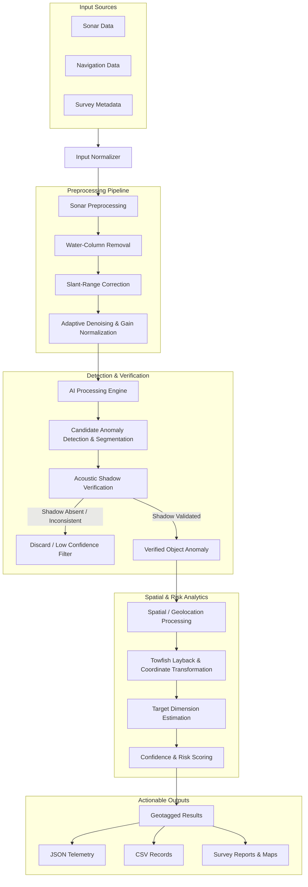
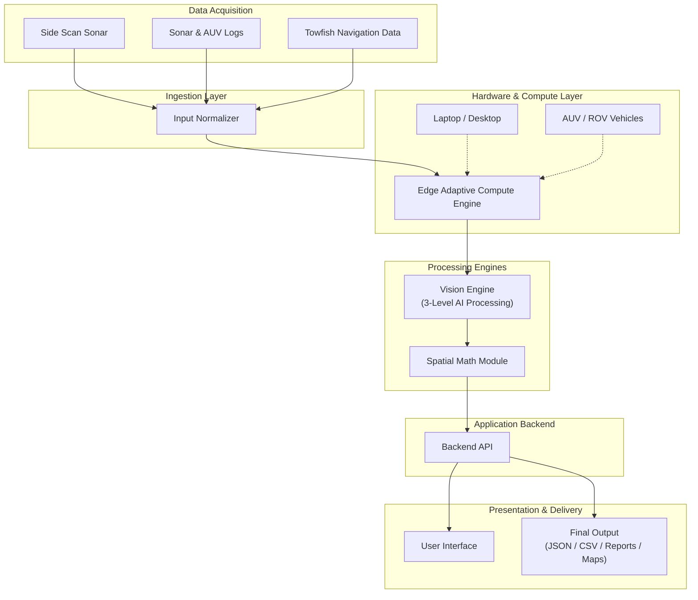
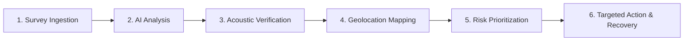

# AquaSentinel AI

> **AI-Powered Automated Underwater Marine Debris and Anomaly Detection System using Side-Scan Sonar Imagery**

[](https://www.sih.gov.in/)
[](https://www.sih.gov.in/)
[](#)
[](#)
[](#)
[](#3-offline-first-architecture)

---

## Table of Contents
- [Problem Statement](#problem-statement)
- [Project Overview](#project-overview)
- [Key Features](#key-features)
  - [1. Adaptive Compute](#1-adaptive-compute)
  - [2. Multi-Source Input](#2-multi-source-input)
  - [3. Offline-First Architecture](#3-offline-first-architecture)
  - [4. Smart Sonar Processing](#4-smart-sonar-processing)
  - [5. AI + Acoustic Verification](#5-ai--acoustic-verification)
  - [6. Geolocation and Risk Mapping](#6-geolocation-and-risk-mapping)
- [System Workflow](#system-workflow)
- [System Architecture](#system-architecture)
- [Technical Approach](#technical-approach)
- [System Outputs](#system-outputs)
- [Feasibility and Viability](#feasibility-and-viability)
  - [Technical Feasibility](#technical-feasibility)
  - [Operational Viability](#operational-viability)
- [Challenges, Risks, and Mitigation Strategies](#challenges-risks-and-mitigation-strategies)
- [Implementation Roadmap](#implementation-roadmap)
- [Impact Analysis](#impact-analysis)
  - [Impact Pathway](#impact-pathway)
  - [Environmental Impact](#environmental-impact)
  - [Operational Benefits](#operational-benefits)
  - [Safety and Economic Benefits](#safety-and-economic-benefits)
- [Comparison](#comparison)
- [Example Use Case](#example-use-case)
- [Repository Structure](#repository-structure)
- [Installation and Setup](#installation-and-setup)
- [Usage](#usage)
- [Project Status](#project-status)
- [Future Scope](#future-scope)
- [Research and References](#research-and-references)

---

## Problem Statement

* **Hackathon:** Smart India Hackathon 2026
* **Problem Statement ID:** SIH26057
* **Problem Statement:** AI-Powered Automated Underwater Marine Debris and Anomaly Detection System using Side-Scan Sonar Imagery
* **Theme:** Sustainable / Marine Environmental Monitoring
* **Category:** Software
* **Team:** Commit & Crack

Modern marine conservation and hydrographic operations rely heavily on Side-Scan Sonar (SSS) surveys to map the seafloor and detect underwater hazards, discarded fishing gear (ghost nets), industrial debris, and structural anomalies. However, reviewing massive sonar waterfall imagery manually is labor-intensive, slow, and error-prone. Natural seabed formations—such as rock formations, coral outcrops, and sediment ripples—frequently mimic artificial debris, leading to high false-positive rates. Moreover, oceanic surveys often take place in offshore regions without internet access, demanding an offline-capable system that can operate directly in the field on variable hardware.

---

## Project Overview

**AquaSentinel AI** is an offline-capable, AI-powered Side-Scan Sonar (SSS) analysis system designed to automatically detect, verify, classify, and geotag underwater marine debris and anomalies.

The system converts large, difficult-to-review sonar surveys into structured, actionable hazard information by synthesizing:
* **Side-scan sonar imagery:** Acoustic backscatter waterfall records and survey tiles.
* **Navigation / GPS data:** Surface vessel trajectory and global positioning fixes.
* **AUV / ROV navigation data:** Subsurface position, heading, velocity, and altitude telemetry.
* **Towfish metadata:** Layback distance, cable-out length, altitude above seabed, and sensor attitude.
* **Survey logs:** Mission timestamps, bathymetric parameters, and hydrographic run-sheets.
* **AI-based detection and segmentation:** Multi-scale feature extraction for candidate localization.
* **Acoustic shadow verification:** Physical validation based on acoustic shadow geometry to eliminate false positives.
* **Spatial / geolocation processing:** Projection mathematics translating pixel offsets to geographic coordinates.
* **Confidence and risk scoring:** Composite index rating hazard urgency for cleanup prioritization.

---

## Key Features

### 1. Adaptive Compute
The system is designed to adapt its AI models and processing configurations dynamically based on the host hardware profile:
* **High-End Systems (Topside Workstations / Survey Rigs):** Executes full multi-scale deep detection, dense segmentation masks, comprehensive gain filtering, and full-resolution spatial mapping.
* **Normal Laptops (Field Notebooks):** Runs optimized inference pipelines delivering bounding-box localization, core acoustic verification, and essential coordinate mapping.
* **Low-End / Edge Devices (AUV / ROV Compute Payloads):** Executes lightweight, detection-only processing tailored for power-restricted and thermally constrained embedded hardware.

> **Operational Utility:** In field deployments and autonomous underwater missions, power supply and computational bandwidth are tightly bounded. Adaptive compute enables AquaSentinel AI to run onboard subsea platforms for real-time target tagging while retaining the ability to leverage full workstation horsepower for in-depth post-mission debriefs.

### 2. Multi-Source Input
The system supports a conceptual ingestion pipeline that integrates:
* Sonar raw waterfall recordings and image extracts
* Hydrographic survey logs and mission run-sheets
* Surface vessel GPS / GNSS navigation data
* Subsea AUV / ROV inertial navigation logs (INS / DVL)
* Towfish altitude, heading, and layback metadata
* Environmental survey metadata (frequency bands, sounding parameters)

### 3. Offline-First Architecture
Marine surveys and underwater cleanup operations routinely occur in offshore and remote locations where cloud connectivity is intermittent or absent. AquaSentinel AI is engineered to operate completely locally without requiring continuous internet connectivity, making it dependable for survey vessels, field inspection laptops, and untethered underwater vehicles.

### 4. Smart Sonar Processing
Raw acoustic data is subject to geometric distortion and environmental noise. The proposed preprocessing pipeline includes:
* **Water-Column Noise Removal:** Automated detection and excision of the nadir water-column blind zone directly beneath the sonar transducer.
* **Sonar Distortion Correction:** Slant-range to ground-range conversion to correct spatial scale distortion across the acoustic swath.
* **Image Enhancement:** Contrast enhancement to balance acoustic backscatter across variable seafloor grazing angles.
* **Adaptive Denoising:** Speckle noise attenuation while preserving the sharp acoustic boundaries of small anomalies.
* **Gain Normalization:** Time-Varied Gain (TVG) and empirical across-track beam pattern correction to balance signal intensity from near-range to far-range.

### 5. AI + Acoustic Verification
To overcome false positives caused by natural seabed structures, AquaSentinel AI employs a dual-stage verification strategy:
1. **Primary AI Identification:** Deep neural network models scan preprocessed imagery to flag candidate objects exhibiting anomalous spatial or intensity characteristics.
2. **Acoustic Shadow Verification:** Acoustic energy cannot penetrate solid obstacles, projecting an acoustic "shadow" (absence of acoustic return) directly behind elevated targets relative to the sensor trajectory. The system evaluates the presence, sharpness, shape, and length of this shadow. Detections lacking a physically consistent acoustic shadow are classified as flat seabed variations and rejected, drastically reducing false positives.

### 6. Geolocation and Risk Mapping
Detection results are combined with navigation and survey metadata to compute:
* **Target Location:** Geographic coordinates (Latitude, Longitude) resolved via sensor layback and swath geometry.
* **Target Dimensions:** Estimated physical footprint (length, width, and acoustic relief height derived from shadow length).
* **Detection Confidence:** Composite statistical score merging visual detection confidence with acoustic shadow consistency.
* **Risk Level:** Hazard categorization (`Low`, `Medium`, `High`, `Critical`) based on anomaly type, dimensions, and navigation relevance.
* **Cleanup Priority:** Structured index guiding the deployment of divers or ROV recovery arms.

#### Example Output Format
```json
{
  "target_id": "SUB-8021",
  "class": "Pipeline Anomaly",
  "confidence": 0.962,
  "location": [24.89, 54.92],
  "dimensions": "1.4m x 0.8m",
  "risk_level": "High"
}
```
*(Note: The above JSON block is an example output format for downstream reporting and telemetry integration.)*

---

## System Workflow

The following flowchart illustrates the proposed pipeline from raw multi-source ingestion to final reporting:



### Stage Explanations
1. **Input Normalizer:** Ingests heterogenous sonar formats, synchronizes timestamps, and aligns navigation records with acoustic pings.
2. **Sonar Preprocessing:** Corrects geometric slant-range distortions, excises the nadir water column, and normalizes acoustic gains across the swath.
3. **AI Processing:** Runs deep detection and segmentation to isolate candidate anomaly regions and debris contours.
4. **Acoustic Verification:** Validates object presence and relief height using acoustic shadow geometry, purging false alarms.
5. **Spatial / Geolocation Processing:** Maps image pixel offsets to real-world coordinates using vessel GPS, towfish layback, and altitude models.
6. **Confidence & Risk Scoring:** Computes holistic operational risk levels and composite confidence metrics.
7. **Geotagged Results:** Packages confirmed targets with coordinates, physical dimensions, and risk tiers.
8. **JSON / CSV / Reports:** Generates structured exports for hydrographic GIS packages, mission databases, and recovery teams.

---

## System Architecture

The following diagram illustrates the major architectural components and their logical relationships:



---

## Technical Approach

The proposed technical architecture is organized into the following functional modules:

```
+-------------------------------------------------------------------------+
| Technology stack will be finalized during implementation.                |
+-------------------------------------------------------------------------+
```

### 1. Data Ingestion
* Ingests dual-channel side-scan sonar recordings (port/starboard waterfall channels).
* Ingests asynchronous telemetry streams from GPS, AUV navigation systems, and towfish depth/altitude sensors.

### 2. Input Normalization
* Aligns high-frequency acoustic pings with timestamped navigational fixes.
* Reconciles coordinate reference frames and interpolates brief dead-reckoning intervals.

### 3. Sonar Preprocessing
* **Water-Column Excision:** Detects the seafloor arrival boundary (first bottom return) and removes the empty water column beneath the sensor.
* **Slant-Range Correction:** Projects acoustic time-of-flight slant ranges into true horizontal ground ranges:
  $$R_{\text{ground}} = \sqrt{R_{\text{slant}}^2 - H^2}$$
  *(where $H$ is the towfish altitude above the seabed).*
* **Gain Normalization & Denoising:** Compensates for beam-spreading attenuation and attenuates acoustic speckle noise while sharpening obstacle boundaries.

### 4. AI Detection / Segmentation
* Multi-scale deep learning models are proposed to detect candidate debris across varied survey resolutions.
* Proposed segmentation heads will delineate exact object contours for non-rigid hazards such as ghost nets or tangled rigging.

### 5. Acoustic-Shadow Verification
* Evaluates acoustic shadow regions cast immediately behind target highlights relative to the sonar track.
* Estimates target relief height $h$ using acoustic shadow trigonometry:
  $$h = \frac{H \times L_s}{R_{\text{slant}}}$$
  *(where $H$ is sensor altitude, $L_s$ is acoustic shadow length, and $R_{\text{slant}}$ is the slant range to the target).*
* Discards detections that lack corresponding shadows, filtering out flat seabed texture variations.

### 6. Spatial Processing
* Computes cross-track and along-track physical distances from the towfish path to the detected target.
* Integrates towfish heading, pitch, roll, and altitude to determine relative spatial offsets.

### 7. Geotagging
* Applies cable layback models (taking into account vessel GPS, cable out, and water depth) or direct AUV INS coordinates to translate relative offsets into real-world geographic coordinates (WGS84).

### 8. Confidence / Risk Scoring
* Generates a composite confidence score factoring in visual feature confidence, acoustic shadow geometric match, and local signal-to-noise ratio.
* Assigns risk ratings based on anomaly type (e.g., snag hazard, chemical drum, navigation obstacle) and target scale.

### 9. Output Generation
* Compiles structured reports, tabular CSV registries, machine-readable JSON feeds, and spatial map layers for immediate operational deployment.

---

## System Outputs

AquaSentinel AI produces structured intelligence for hydrographers, marine scientists, and salvage teams:

* **Detection / Classification:** Specific identification of anomalies (e.g., Ghost Fishing Nets, Submerged Drums, Tires, Pipeline Anomalies, Shipwreck Debris).
* **Segmentation / Masks:** Precise spatial masks outlining the shape and footprint of non-rigid or dispersed debris.
* **Confidence Score:** Probabilistic verification index (0.00 to 1.00) quantifying detection reliability.
* **Target Dimensions:** Calculated physical length, width, and estimated acoustic relief height in meters.
* **Risk Score / Level:** Actionable hazard rating (`Low`, `Medium`, `High`, `Critical`) reflecting environmental and navigational severity.
* **Approximate Coordinates:** Real-world WGS84 geographic coordinates (Latitude and Longitude).
* **JSON / CSV Telemetry:** Structured data exports for integration into maritime databases and command centers.
* **Maps and Reports:** Printable survey summaries, annotated sonar snippets, and GIS-compatible spatial overlays.

---

## Feasibility and Viability

### Technical Feasibility
* **Established Baselines:** Built upon proven computer vision architectures and established hydrographic signal processing principles (slant-range correction, TVG normalization).
* **Modular Architecture:** Subsystems (preprocessing, AI inference, spatial calculation) are decoupled, allowing independent development, testing, and optimization.
* **Independent Module Optimization:** Algorithms can be individually benchmarked and hardware-accelerated without altering surrounding services.
* **Offline Processing Pipeline:** Autonomous local processing guarantees that offshore missions are never halted by connectivity loss.
* **Lightweight Inference for Edge AI:** Tiered compute profiles allow quantized, lightweight inference pipelines to execute reliably on embedded edge platforms.

### Operational Viability
* **Local / Edge Deployment:** Direct deployment aboard survey vessels or inside AUVs delivers real-time or near-real-time results.
* **Reduced Cloud Dependency & Latency:** Eliminates expensive offshore satellite data uplinks and eliminates cloud processing latency.
* **Low Hardware Overhead:** Compatibility with commercial off-the-shelf laptops ensures low adoption cost for field hydrographers.
* **Adaptability to Sonar Sensors:** Standardized input normalization ensures the pipeline can interface with diverse commercial side-scan sonar models.
* **Field-Actionable Geotagging:** Provides coordinate outputs directly usable by recovery teams, divers, and autonomous surface vessels.

---

## Challenges, Risks, and Mitigation Strategies

| Challenge / Risk | Operational Impact | Proposed Mitigation Strategy |
| :--- | :--- | :--- |
| **High Acoustic Sonar Noise & Distortion** | Speckle noise, multipath echoes, and beam spreading obscure target boundaries and degrade feature clarity. | Implement adaptive noise filtering, speckle reduction filters, and empirical across-track gain normalization. |
| **Seafloor Structures Resembling Debris** | Natural rock formations, ridges, and coral reefs trigger high false-alarm rates in standard vision models. | Utilize acoustic shadow feature analysis to verify 3D height profile and confirm whether candidates represent elevated physical hazards. |
| **Scarcity of Labeled Datasets** | Publicly accessible, annotated underwater side-scan sonar datasets are limited compared to optical imagery. | Apply transfer learning, domain adaptation, and synthetic data augmentation to expand training diversity. |
| **False Positives in Complex Terrain** | Highly textured or rugged seabed terrains introduce visual clutter and anomalous reflections. | Employ hard-negative mining during model training and enforce strict dual-stage confidence thresholds combining AI scores with acoustic shadow geometry. |

*(Note: The mitigations described above represent proposed strategies designed to address domain-specific risks.)*

---

## Implementation Roadmap

The proposed implementation roadmap is divided into six structured phases:

| Phase | Focus Area | Proposed Deliverables & Objectives |
| :---: | :--- | :--- |
| **Phase 1** | **Dataset Preparation** | Curate raw sonar logs; establish annotation taxonomy; generate verified bounding-box and segmentation datasets. |
| **Phase 2** | **Preprocessing** | Develop adaptive denoising filters, automated water-column removal, and gain enhancement algorithms. |
| **Phase 3** | **Model Training** | Implement and fine-tune multi-scale deep-learning architectures for underwater anomaly detection. |
| **Phase 4** | **Validation** | Perform accuracy benchmarking, precision-recall testing, and shadow verification reliability assessments. |
| **Phase 5** | **Geotagging** | Implement acoustic-shadow trigonometry rules, towfish layback transforms, and GPS coordinate tagging. |
| **Phase 6** | **Field Integration** | Integrate processing engines with the UI dashboard, run end-to-end tests, and conduct live field survey trials. |

---

## Impact Analysis

### Impact Pathway


### Environmental Impact
* **Faster Identification of Marine Debris & Ghost Nets:** Speeds up the discovery of abandoned, lost, or discarded fishing gear (ALDFG) that continuously traps marine wildlife.
* **Protection of Marine Biodiversity:** Prevents wildlife mortality caused by ingestion or entanglement in synthetic debris.
* **Protection of Coral Reef Ecosystems:** Prevents heavy debris from dragging across and fracturing fragile coral reefs.
* **Targeted and Sustainable Cleanup:** Enables direct, surgical recovery missions, reducing the environmental disturbance of extensive seafloor dragging.

### Operational Benefits
* **Reduced Manual Sonar Inspection:** Automates thousands of hours of manual acoustic waterfall review, reducing analyst fatigue.
* **Consistent Confidence-Scored Verification:** Standardizes anomaly verification across diverse operators and survey missions.
* **Efficient Cleanup Planning:** Provides operational teams with prioritized recovery lists based on verified risk scores.
* **Faster Identification of Targets:** Accelerates the post-survey analysis cycle from weeks to hours.

### Safety and Economic Benefits
* **Reduced Vessel and Equipment Risks:** Locates submerged shipping containers, lost anchors, and navigational hazards that endanger ship hulls, propellers, and towed equipment.
* **Better Use of Cleanup Resources:** Prevents costly recovery dives on natural rock formations by verifying anomalies through acoustic shadow geometry.
* **Lower Operational Costs:** Minimizes ship charter time and survey operational expenditures through rapid data processing.
* **More Actionable Operational Decisions:** Equips port authorities, navies, and environmental agencies with structured, auditable hazard registries.

---

## Comparison

| Capability | Manual SSS Inspection | Generic AI Detection | AquaSentinel AI |
| :--- | :--- | :--- | :--- |
| **Detection** | Manual visual inspection of waterfall displays | Bounding boxes via standard vision models | Multi-scale Detection + Segmentation |
| **Verification** | Subjective human expert judgement | Visual feature confidence only | AI + Acoustic Shadow Physical Verification |
| **Inputs** | Survey-specific proprietary viewers | Primarily standalone static images | Sonar Images + Logs + Nav Data + Metadata |
| **Deployment** | Heavy office workstations | GPU / Cloud infrastructure often preferred | Offline-First + Device-Adaptive Compute |
| **Output** | Manual notes and highlighted screenshots | Visual bounding boxes | Geotagged Location + Confidence + Risk + Reports |

---

## Example Use Case

The following walkthrough illustrates a proposed operational scenario using AquaSentinel AI:

1. **Survey Data Acquisition:** An Autonomous Underwater Vehicle (AUV) or surface-towed towfish conducts an acoustic survey along a coastal shipping lane, gathering dual-channel side-scan sonar data and synchronized navigation logs.
2. **Data Normalization:** AquaSentinel AI imports the survey dataset, synchronizing time-stamped acoustic records with GPS coordinates, towfish altitude, and sensor attitude.
3. **Smart Preprocessing:** The preprocessing engine excises the nadir water column, performs slant-range correction to map ground distances accurately, and equalizes acoustic gain across the swath.
4. **Candidate AI Detection:** The vision engine analyzes the processed imagery and identifies a candidate anomaly resting on the seabed.
5. **Acoustic Shadow Analysis:** The verification engine detects and measures the acoustic shadow cast behind the object, verifying an elevated profile of 1.4 meters and confirming it is a solid 3D obstacle rather than flat seafloor texture.
6. **Geolocation Calculation:** The spatial math engine combines towfish position, heading, and cross-track offset to calculate precise geographic coordinates.
7. **Risk & Priority Assignment:** The object is categorized as a pipeline hazard, assigned a 96.2% confidence score and a "High" risk rating.
8. **Actionable Export:** The system outputs georeferenced JSON records, spatial map layers, and an executive survey report, enabling recovery vessels to dispatch an ROV directly to the site.

*(Note: The above scenario represents a proposed workflow.)*

---

## Repository Structure

The proposed repository structure for the project is organized as follows:

```text
AquaSentinel-AI/
├── frontend/             # Proposed user interface and map visualization dashboard
├── backend/              # Proposed application server and orchestration API
├── vision-engine/        # Proposed AI models and detection/segmentation inference modules
├── preprocessing/        # Sonar slant-range correction, water-column removal, and gain normalization
├── geospatial/           # Spatial mathematics, layback modeling, and coordinate transformation
├── models/               # Model weights, configurations, and export schemas
├── datasets/             # Dataset loaders, annotation parsers, and synthetic augmentation tools
├── configs/              # Configuration files for sensor types and compute profiles
├── scripts/              # Data conversion, benchmarking, and batch execution scripts
├── tests/                # Unit tests, integration tests, and telemetry validation suites
├── docs/                 # System architecture specifications, user guides, and research notes
├── outputs/              # Generated reports, JSON telemetry packages, and exported map layers
├── README.md             # Project documentation and developer overview
└── LICENSE               # Repository license file
```

*(Note: The directory layout above is a proposed structure for implementation and does not imply that all folders are currently populated.)*

---

## Installation and Setup

> **Implementation status:** Setup and installation instructions will be added once the technology stack and repository structure are finalized.

```bash
# Clone repository
git clone <repository-url>

# Enter project directory
cd AquaSentinel-AI

# Install dependencies
<installation-command>

# Start application
<run-command>
```

---

## Usage

The proposed usage flow for operating AquaSentinel AI:

1. **Import Sonar Survey Data:** Load raw side-scan sonar recordings or acoustic imagery.
2. **Import Navigation / Metadata:** Ingest concurrent vessel GPS, AUV navigation, and towfish telemetry logs.
3. **Select Compute Profile:** Choose the appropriate compute tier (`Workstation`, `Laptop`, or `Edge/AUV`).
4. **Run Sonar Preprocessing:** Execute water-column removal, slant-range correction, and gain normalization.
5. **Run AI Detection:** Initiate multi-scale anomaly detection and debris segmentation.
6. **Perform Acoustic Verification:** Validate candidate detections through acoustic shadow geometric analysis.
7. **Generate Geotagged Results:** Calculate true geographic coordinates and estimated physical dimensions.
8. **Export JSON / CSV / Reports:** Generate structured telemetry records, spatial hazard maps, and operational mission reports.

---

## Project Status

The checklist below outlines planned and in-progress development objectives:

- [ ] Dataset preparation
- [ ] Sonar preprocessing pipeline
- [ ] AI detection model
- [ ] Acoustic verification
- [ ] Geolocation module
- [ ] Risk scoring
- [ ] Backend API
- [ ] Dashboard
- [ ] Edge deployment
- [ ] Field validation

---

## Future Scope

The following enhancements are identified as planned extensions for future development:
* **Improved Edge Inference:** Further optimization and quantization for ultra-low-power embedded subsea microcomputers.
* **Expanded Labeled Sonar Datasets:** Integration with wider hydrographic repositories to cover broader seabed classes and debris varieties.
* **Expanded Sensor Compatibility:** Direct plug-in drivers for additional commercial multi-beam and side-scan sonar hardware formats.
* **Real-Time AUV / ROV Integration:** Direct in-mission streaming and real-time obstacle tagging via vehicle telemetry buses.
* **Enhanced Geospatial Visualization:** Real-time 3D bathymetric draping and interactive subsea mapping overlays.
* **Continuous Field Validation:** Ongoing benchmarking against live survey trials across diverse marine environments.
* **Advanced Anomaly Classification:** Finer-grained categorization of industrial debris, hazardous materials, and subsea infrastructure anomalies.

---

## Research and References

The conceptual foundation and methodology of AquaSentinel AI draw from the following research initiatives and open-source contributions:

* **Microsoft Research — GhostNetZero: AI for Detecting Marine Ghost Nets:**  
  [https://www.microsoft.com/en-us/research/publication/ghostnetzero-ai-for-detecting-marine-ghost-nets/](https://www.microsoft.com/en-us/research/publication/ghostnetzero-ai-for-detecting-marine-ghost-nets/)

* **SideScanTools — Open-source software for side-scan data processing:**  
  [https://ihr.iho.int/articles/sidescantools-an-open-source-software-for-sidescan-data-processing/](https://ihr.iho.int/articles/sidescantools-an-open-source-software-for-sidescan-data-processing/)

* **MDPI Remote Sensing research:**  
  [https://www.mdpi.com/2072-4292/18/11/1679](https://www.mdpi.com/2072-4292/18/11/1679)

* **SeaClear dataset / fusion code:**  
  [https://github.com/adjuras/seaclear-dataset/tree/main/fusion_code](https://github.com/adjuras/seaclear-dataset/tree/main/fusion_code)

* **AI4Shipwrecks:**  
  [https://umfieldrobotics.github.io/ai4shipwrecks/](https://umfieldrobotics.github.io/ai4shipwrecks/)

* **arXiv research paper:**  
  [https://arxiv.org/abs/2503.22880](https://arxiv.org/abs/2503.22880)
# Aqua-Sentinel

